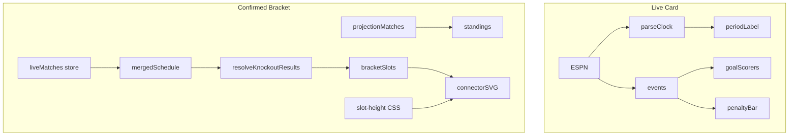

# Live match + bracket fixes

Two workstreams: **live card bugs** (period label, penalties, scorers) and **bracket bugs** (confirmed mode, badges, connectors).

---

## Part A — Live card fixes

### A1 — Wrong period label at 106' (confirmed)

Root cause in [`parseEspnClockFields`](src/services/ESPNClient.ts): `periodNum === 2 || detail.includes("2nd")` maps to `second_half` even when `displayClock` is `106'`.

**Fix (two layers):**

1. **Source** — after parsing `clockMinute`, run `inferPeriodFromClock`:
   - `>= 106` (not `penalties`/`full_time`) → `extra_time_second`
   - `91–105` + `second_half` → `extra_time_first`
   - `periodNum === 3/4` → `extra_time_first` / `extra_time_second`
2. **Display** — same helper in [`formatMatchClock.ts`](src/lib/formatMatchClock.ts); extend `formatPeriodLabel(period, status, clockMinute?)`; pass `match.clockMinute` from [`LiveMatchBento.tsx`](src/components/bentos/LiveMatchBento.tsx).

**Tests:** [`ESPNClient.test.ts`](src/services/ESPNClient.test.ts), [`formatMatchClock.test.ts`](src/lib/formatMatchClock.test.ts).

### A2 — Penalty shootout UI (enhance existing)

[`PenaltyShootoutBar`](src/components/match/PenaltyShootoutBar.tsx) already exists. Do **not** add `PenaltyShootoutStrip`.

- Broaden gate in `LiveMatchBento` when `penaltyShootout` exists and period is stale
- Enhance bar in place: team rows, player name tooltips, active-kick pulse, sudden-death label

### A3 — Goal scorers (event pipeline, not new types)

[`MatchGoalScorers`](src/components/match/MatchGoalScorers.tsx) already renders in `LiveMatchBento`. Empty state = missing `matchEvents`.

- Prioritize `fetchMatchEvents` for `primaryLiveMatchId` in [`DataOrchestrator.live.ts`](src/services/orchestrator/DataOrchestrator.live.ts)
- Add knockout event-key regression test for `resolveEventsForMatch`
- **Do not** add `homeGoalScorers` to [`MergedMatch`](src/types.ts)

---

## Part B — Bracket fixes

### B1 — Confirmed mode ignores live knockout results

**Symptom:** Netherlands vs Morocco live at 2-1 still shows model-projected winner; M89 downstream slots don't update until FT.

**Root cause is deeper than the `projectionMatches` filter alone.**

Current flow in [`BracketBento.tsx`](src/components/bentos/BracketBento.tsx):

```381:395:src/components/bentos/BracketBento.tsx
  const projectionMatches = useMemo(
    () =>
      matches.filter((m) => {
        if (mode === "confirmed") {
          return (
            m.homeScore !== undefined &&
            m.awayScore !== undefined &&
            m.status === "completed" &&
            m.locked
          );
        }
```

Knockout overlay uses a **separate** path — [`resolveKnockoutResults`](src/lib/tournament.ts) via `mergedSchedule` — but only stamps **completed** matches:

```777:781:src/lib/tournament.ts
  for (const match of mergedMatches) {
    if (!isKnockoutMatch(match)) continue;
    if (match.status !== "completed") continue;
```

`BracketCardReadonly` already shows live scores via `lookupBracketLiveMatch`, but winner propagation into M89 requires `resolveKnockoutResults` changes.

**Fix (two coordinated changes):**

1. **`BracketBento` `projectionMatches`** — in confirmed mode, also include live matches with scores (your proposed filter):

```ts
if (mode === "confirmed") {
  return (
    m.homeScore !== undefined &&
    m.awayScore !== undefined &&
    ((m.status === "completed" && m.locked) || m.status === "live")
  );
}
```

This keeps group standings current during live group games.

2. **`resolveKnockoutResults` / `buildCompletedKnockoutLookup`** — extend to handle `status === "live"` knockout matches:
   - Stamp live `homeScore` / `awayScore` on the bracket slot
   - If one team leads (or pens decided): set provisional `winnerTeamId`; mark slot certainty **`projected`** (not `confirmed`) — live is not final
   - If tied live: stamp scores, leave `winnerTeamId` unset; downstream slots stay model-projected until someone leads
   - Tied at FT during live ET/penalties: defer winner until completed (existing penalty logic)

3. **`visibleBracketStages`** — in confirmed mode, reveal R16+ when a downstream slot has a **confirmed or live-provisional** feeder winner (not only `homeCertainty === "confirmed"`).

4. **Tests** in [`resolveKnockoutResults.test.ts`](src/lib/resolveKnockoutResults.test.ts):
   - Live M74 with Morocco leading → M89 gets Morocco in W74 slot with `projected` certainty
   - Live tie → no winner propagation
   - FT completed still stamps `confirmed`

**Feed map note (Problem 4):** M74 winner goes to **M89** (`W74` vs `W77`), not Canada. Canada (W73) goes to **M90** (`W73` vs `W75`). [`bracketTree.test.ts`](src/lib/bracketTree.test.ts) already asserts `M90 → [M73, M75]`. [`LiveBracketContextPanel`](src/components/bentos/LiveBracketContextPanel.tsx) already shows the correct sibling feeder via `siblingFeederMatchId` — no copy change needed unless UX testing shows confusion.

---

### B2 — "LOCKED IN" badge on knockout cards

**Symptom:** Knockout R32 cards show `CertaintyBadge certainty="confirmed"` ("Locked in") for teams that clinched group qualification — misleading on a knockout fixture card.

**Root cause:** [`isTeamSlotConfirmed`](src/components/bentos/BracketBento.tsx) uses **group qualification** certainty for R32:

```113:115:src/components/bentos/BracketBento.tsx
  if (match.stage === "R32") {
    return computeQualificationStatus(teamId, standings, qualContext).certainty === "confirmed";
  }
```

That drives `slotConfirmed` → `effectiveCertainty === "confirmed"` → LOCKED IN badge in [`BracketTeamReadonly`](src/components/bentos/BracketBento.tsx).

**Fix:**

- Pass `stage={match.stage}` into `BracketTeamReadonly` from `BracketCardReadonly`
- Suppress the `confirmed` CertaintyBadge on **all knockout stages** (`R32` | `R16` | `QF` | `SF` | `Final`)
- Keep `slotConfirmed` logic for ghost/TBD display; only hide the badge
- Optional: show a subtler "Live" or score-based indicator instead when `lookupBracketLiveMatch` returns a live match (already have scoreline)

Do **not** use `!stage` as the gate (all bracket matches have a stage). Gate on `stage !== undefined` for knockout enum values.

---

### B3 — Broken bracket connector lines

**Symptom:** SVG [`BracketConnectorOverlay`](src/components/bentos/BracketConnectorOverlay.tsx) lines miss card midpoints because round columns use ad-hoc `margin-top` offsets instead of mathematically aligned slots.

Current layout in [`app-views.css`](src/styles/app-views.css):

```1618:1622:src/styles/app-views.css
.bracket-rounds .bracket-round:nth-child(2) { margin-top: 50px; }
.bracket-rounds .bracket-round:nth-child(3) { margin-top: 113px; }
.bracket-rounds .bracket-round:nth-child(4) { margin-top: 237px; }
.bracket-rounds .bracket-round:nth-child(5) { margin-top: 485px; }
```

[`styles.css`](src/styles.css) has a parallel legacy flex layout with `::before`/`::after` pseudo-connectors (disabled in `.bracket-view`).

**Fix — slot-height flex layout:**

Replace round column layout in **`app-views.css`** (primary; used by `BracketBento`):

- `.bracket-rounds`: `display: flex`, `min-height: calc(16 * var(--bracket-slot-h, 88px))`, `position: relative` (SVG overlay anchor)
- `.bracket-round`: `flex-direction: column`, `justify-content: space-around`
- Per-round `.bracket-cell` flex basis: R32 `100%/16`, R16 `100%/8`, QF `100%/4`, SF `100%/2`, Final `100%`
- Remove magic `margin-top` nth-child offsets
- Keep [`BracketConnectorOverlay`](src/components/bentos/BracketConnectorOverlay.tsx) — aligned midpoints should make SVG paths land correctly without re-measuring

Also update matching rules in [`styles.css`](src/styles.css) and [`.live-bracket-embed`](src/styles/app-views.css) overrides so [`SimulatorView`](src/components/simulator/SimulatorView.tsx) and embedded bracket stay consistent.

Use CSS variable `--bracket-slot-h` so card height tweaks don't break alignment.

---

### B4 — Feed map verification (data only)

[`BRACKET_FEED_MAP`](src/lib/bracketTree.ts) is built from [`knockoutRoundFixtures.ts`](src/lib/brackets/knockoutRoundFixtures.ts). Add explicit test:

```ts
expect(BRACKET_FEED_MAP.M89).toEqual(["M74", "M77"]);
expect(findChildBracketMatchId("M74")).toBe("M89");
```

No changes expected to `tournament.ts` fixture definitions.

---

## Architecture diagram



---

## Execution order

| Priority | File(s) | Change |
|---|---|---|
| 1 | [`tournament.ts`](src/lib/tournament.ts) + test | Live knockout overlay in `resolveKnockoutResults` |
| 2 | [`BracketBento.tsx`](src/components/bentos/BracketBento.tsx) | `projectionMatches` filter; suppress knockout LOCKED IN badge; pass `stage` |
| 3 | [`app-views.css`](src/styles/app-views.css) + [`styles.css`](src/styles.css) | Slot-height flex bracket layout |
| 4 | [`bracketTree.test.ts`](src/lib/bracketTree.test.ts) | M89/M74 feed assertions |
| 5 | [`ESPNClient.ts`](src/services/ESPNClient.ts) + [`formatMatchClock.ts`](src/lib/formatMatchClock.ts) | ET period inference |
| 6 | [`LiveMatchBento.tsx`](src/components/bentos/LiveMatchBento.tsx) + [`PenaltyShootoutBar.tsx`](src/components/match/PenaltyShootoutBar.tsx) | Period param, penalty gate, bar UI |
| 7 | [`DataOrchestrator.live.ts`](src/services/orchestrator/DataOrchestrator.live.ts) | Primary match event fetch priority |

## Version bump

`npm run version:build -- --message "fix live ET label, bracket live scores, connector layout, penalty bar"`

## Out of scope

- Changing FIFA feed definitions (M74→M89, M73→M90 are correct)
- New `PenaltyShootoutStrip` component
- `MergedMatch.homeGoalScorers` / `dataSources.ts` changes
