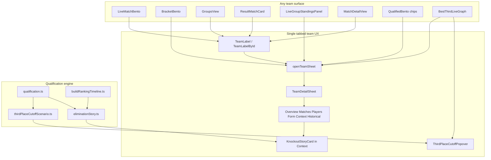

# Live Qualification UX — Updated Architecture Plan

## Product brief (from `/architect` prompt)

Build a tightened **World Cup 2026 live qualification experience** with two specific UI surfaces:

1. **Exact hover/tap popover** for the current **8th best third-place team** (cutoff case)
2. **Eliminated-team “knockout story” card** in the team profile

Plus a **locked-in core app rule**: universal team click behavior everywhere.

### Format rules (WC 2026 only)

- Top two from each group qualify automatically
- Eight best third-place teams also qualify
- Third-place ranking tiebreakers: **points → goal difference → goals scored → team conduct → FIFA ranking**
- **Eliminated** = no remaining results can restore a qualifying position
- **Alive** = any mathematical path remains
- **Rank 8** among third-place teams is the special cutoff case

### UX constraints

- Live screen stays **match-first**
- Below live content: who is **through**, **alive**, **on the bubble**, **eliminated**
- Live qual section stays **compact by default**
- Popover + knockout card **responsive** (desktop hover, mobile tap + info icon)
- **No hardcoded per-team text** — reusable scenario builders only
- Derive all state from the **same qualification engine** used elsewhere

---

## Core app rule — Universal team drawer

**Locked in.** One interaction model across the entire app.

### Rule (verbatim for implementation prompts)

```text
Universal team interaction rule:
- Any team shown anywhere in the app must be clickable.
- Clicking a team opens one shared team drawer.
- The same drawer must be used across live cards, brackets, groups, results, standings, match detail, and any other team-rendering surface.
- The drawer must link to and reuse the current team profile.
- Do not build separate team panels per screen.
- Do not duplicate team interaction logic.
- Use one shared team drawer component and one shared team profile source of truth.
```

**Combined phrasing:**

```text
Also add a universal team interaction rule: any team shown anywhere in the app must be clickable, and clicking it opens one shared team drawer linked to the current team profile. This must work consistently throughout the entire project, including live screens, brackets, groups, results, standings, match detail, and any other place a team appears. Do not create screen-specific team panels or duplicate team-click behavior. The team drawer must always reuse the same team profile source of truth.
```

### What the drawer is today

[`TeamDetailSheet`](src/components/team-detail/TeamDetailSheet.tsx) mounted once in [`AppShell`](src/components/layout/AppShell.tsx), opened via `openTeamSheet(teamId)` from [`uiSlice`](src/store/slices/uiSlice.ts). **This is the single team drawer** — do not add parallel panels.

**Current tabs (to refactor):** `overview | squad | fixtures | stats | media | betting`

---

## Locked in — Tabbed team drawer hub

**Why:** Tabs keep the drawer broad enough to hold everything without one overwhelming scroll view. Works on mobile and desktop.

### Target tab structure

| Tab | Purpose | Primary content |
|-----|---------|-----------------|
| **Overview** | At-a-glance team snapshot | Qual badge + status one-liner, group standing summary, key stats (GP/W/D/L, GF/GA/GD, pts), coach, FIFA rank, optional highlights teaser |
| **Matches** | Full match history | WC 2026 fixtures/results from store, `openMatchDetail` links, SofaScore recent/upcoming when available |
| **Players** | Roster | [`Wc2026SquadList`](src/components/team-detail/Wc2026SquadList.tsx), Zafronix roster, SofaScore fallback — photos + positions |
| **Form** | Recent momentum | Zafronix historical matches (`getHistoricalMatchesForTeam`), W/D/L strip, last-N results list |
| **Context** | What matters now for the tournament | Qualification path, **KnockoutStoryCard**, third-place scenario summary, best-third rank, cutoff watch list, odds/betting panel (moved from separate tab) |
| **Historical** | Notable past facts *(conditional)* | World Cup titles, notable all-time players for nation, derivable milestones — **tab hidden when nothing notable** |

### Tab migration map (current → new)

| Current tab | New home |
|-------------|----------|
| `overview` (standings, qual block, form strip, sofa match lists) | Split: **Overview** (summary) + **Form** (form strip) + **Matches** (sofa lists) + **Context** (qual block → replaced by richer Context panel) |
| `squad` | **Players** |
| `fixtures` | **Matches** (+ clickable rows → `openMatchDetail`) |
| `stats` | **Overview** (key stats) + optional detail subsection in Overview or Players |
| `media` | **Overview** teaser link or collapsible strip — not a top-level tab |
| `betting` | **Context** (“what matters now”) |

### Historical tab rule

**Why:** History should add value, not clutter.

- Include historical facts **only when notable or helpful**
- Keep low-value history out if it would bury current tournament context
- **Historical is an enrichment layer**, not a dumping ground
- If the API does not support a fact, **do not invent it**
- Hide the Historical tab entirely when `hasNotableHistory(teamId) === false`

**Derivable sources (v1):**

- [`worldCupAllTimeLeaders.ts`](src/data/worldCupAllTimeLeaders.ts) — team title count, nation-linked all-time scorers/appearances (match by country name)
- Zafronix / SofaScore team profile fields when present (manager tenure, market value — only if API returns)
- WC 2026 squad confirmation facts only when in official dataset

**New module:** [`src/lib/teamHistoricalFacts.ts`](src/lib/teamHistoricalFacts.ts) — `buildTeamHistoricalFacts(team, apiProfiles) → { facts: HistoricalFact[]; hasNotable: boolean }`

### Universal team drawer rule (verbatim — updated)

```text
Universal team drawer rule:
- Any team shown anywhere in the app must open the same shared team drawer.
- The drawer must be tabbed.
- Tabs must include Overview, Matches, Players, Form, Context, and Historical when notable history exists.
- The drawer should surface as much useful information as the available API endpoints can provide.
- Historical information should be included only when it is notable and derivable from available data.
- Do not invent history or add unsupported facts.
- Reuse the same team profile source of truth across the entire app.
- The team drawer must work consistently from live screens, brackets, groups, results, standings, and match detail.
```

**Final combined line:**

```text
Team drawers should display everything available and useful from the API: one universal shared drawer for every team in the app, organized into tabs (Overview, Matches, Players, Form, Context, Historical). Include as much team information, match history, player data, qualification context, and notable historical facts as can be derived from available endpoints, but do not invent unsupported history.
```

### Deep-linking between tabs

- Knockout story “See all their World Cup games” → **Matches** tab
- Knockout story “See the match that knocked them out” → `openMatchDetail` (drawer may close or stay open — prefer stay open on desktop, close on mobile if viewport tight)
- Eliminated bento chip click → open drawer on **Context** tab (scroll to KnockoutStoryCard)
- Rank-8 popover “open team” → drawer **Context** tab with third-place summary

Store extension (optional): `openTeamSheet(teamId, { tab?: TeamDrawerTab })` in [`uiSlice`](src/store/slices/uiSlice.ts)

### What the drawer must show (summary)

- **Overview:** current status, key stats, qualification state one-liner
- **Matches:** all results, fixtures, match detail links
- **Players:** roster, photos, API player info
- **Form:** recent results and momentum
- **Context:** qualification path, elimination story, third-place scenario, odds — what matters now
- **Historical:** notable past facts only when derivable and worth showing

### Implementation strategy — wire once, use everywhere

**Centralize click behavior** in the lowest-level team primitives rather than per-screen `onClick` handlers:

| Primitive | Change |
|-----------|--------|
| [`TeamLabel`](src/components/team/TeamLabel.tsx) | Wrap in `<button>` (or add optional `onTeamClick` defaulting to `openTeamSheet`); stop propagation when nested inside match cards that open match detail |
| [`TeamLabelById`](src/components/team/TeamLabelById.tsx) | Same |
| [`TeamFlag`](src/components/team/TeamFlag.tsx) | Optional: inherit click from parent; do not add independent handlers unless used standalone |
| [`QualTeamChip`](src/components/bentos/QualifiedBento.tsx) | Convert to button → `openTeamSheet` |
| [`BracketTeamButton`](src/components/team/BracketTeamButton.tsx) | Already a button — ensure `onClick` always calls `openTeamSheet` (bracket context may add secondary behavior) |

**New helper (optional thin wrapper):**

- `useOpenTeam()` hook → `{ openTeam: (id) => openTeamSheet(id) }` for components that need explicit wiring
- Or `TeamClickTarget` component for non-label surfaces (table rows, ladder rows)

**Event nesting rule:** When a team label sits inside a clickable match card, team click must **stop propagation** and open the team drawer; match card click opens match detail. Same pattern as venue popover vs card click.

### Audit — surfaces to wire (current gaps)

**Already wired to `openTeamSheet`:**

- [`GroupTableBento`](src/components/bentos/GroupTableBento.tsx)
- [`LiveGroupStandingsPanel`](src/components/bentos/LiveGroupStandingsPanel.tsx)
- [`RecentResultsBento`](src/components/bentos/RecentResultsBento.tsx)
- [`BracketBento`](src/components/bentos/BracketBento.tsx) via `BracketTeamButton`
- [`TeamsView`](src/components/views/TeamsView.tsx)
- [`TournamentStandingsTab`](src/pages/tournament/components/tabs/TournamentStandingsTab.tsx)
- [`ResultMatchCard`](src/components/match/ResultMatchCard.tsx) — partial (home only on card click)

**Not wired (must fix):**

- [`TeamLabel`](src/components/team/TeamLabel.tsx) / [`TeamLabelById`](src/components/team/TeamLabelById.tsx) — used by live cards, schedule, match detail **without click**
- [`LiveMatchBento`](src/components/bentos/LiveMatchBento.tsx)
- [`MatchScheduleCard`](src/components/match/MatchScheduleCard.tsx)
- [`MatchDetailView`](src/pages/match/MatchDetailView.tsx)
- [`QualifiedBento`](src/components/bentos/QualifiedBento.tsx) — `QualTeamChip` not clickable
- [`BestThirdLiveGraph`](src/components/bentos/BestThirdLiveGraph.tsx) — ladder/focus rows
- [`BestThirdRankingTable`](src/components/bentos/BestThirdRankingTable.tsx)
- [`GroupsView`](src/components/views/GroupsView.tsx) — verify group tables
- [`SimulatorView`](src/components/simulator/SimulatorView.tsx) — simulator-only teams
- Tournament stats feeds (`TournamentLeaderboard`, `MatchAwardsFeed`)

**Implementation order:** Do universal team drawer **first** (or in parallel with knockout card) so qual polish and elimination story land in the drawer users already reach from every surface.

---

## Approved decisions (from prior architect Q&A)

| Topic | Decision |
|-------|----------|
| Elimination story when derivation fails | **Partial placeholder** — show card with “can’t pinpoint exact moment” + known facts; **never fabricate** match/goal |
| Original prompt “stop and ask before guessing” | Applies to **implementation**: if engine cannot derive knockout moment and product choice is unclear, **pause and ask** — do not ship invented copy |
| Team interaction model | **One shared tabbed drawer** (`TeamDetailSheet`) — no screen-specific team panels |
| Historical tab | **Conditional** — show only when notable facts derivable from data; never invent |

---

## Current state — reuse, do not rewrite

| Capability | Existing module |
|------------|-----------------|
| Shared team drawer | [`TeamDetailSheet`](src/components/team-detail/TeamDetailSheet.tsx) + `openTeamSheet` in [`uiSlice`](src/store/slices/uiSlice.ts) |
| Top-2 + best-8 third-place rules | [`src/lib/thirdPlaceQualification.ts`](src/lib/thirdPlaceQualification.ts), [`src/lib/qualification.ts`](src/lib/qualification.ts) |
| Tiebreak order | [`src/lib/thirdPlaceRanking.ts`](src/lib/thirdPlaceRanking.ts) |
| Bubble / cutoff rank 8 | [`src/lib/thirdPlaceLiveStatus.ts`](src/lib/thirdPlaceLiveStatus.ts) (`CUTOFF_RANK = 8`, `getThirdPlaceBubbleState`) |
| Goal-by-goal replay + cutoff crossings | [`src/lib/buildRankingTimeline.ts`](src/lib/buildRankingTimeline.ts), [`src/hooks/useRankingTimeline.ts`](src/hooks/useRankingTimeline.ts) |
| Live best-third ladder (rank 8 styled) | [`src/components/bentos/BestThirdLiveGraph.tsx`](src/components/bentos/BestThirdLiveGraph.tsx) — `rank === 8 ? styles.ladderCut` |
| Live qual buckets | [`QualifiedBento`](src/components/bentos/QualifiedBento.tsx), `InContentionBento`, `EliminatedBento` on [`LiveView.tsx`](src/components/views/LiveView.tsx) |
| Hover/tap popover pattern | [`VenueLabel.tsx`](src/components/venue/VenueLabel.tsx) + [`VenuePopover.tsx`](src/components/venue/VenuePopover.tsx) |
| Match navigation | `openMatchDetail` via [`navigationSlice.ts`](src/store/slices/navigationSlice.ts) |
| Copy hub | [`src/lib/appCopy.ts`](src/lib/appCopy.ts) |

**Gap:** Universal click not centralized; qual scenario builders and knockout card not built yet.

---

## Architecture



---

## Surface 1 — Rank-8 third-place popover

### Trigger

- Attach to the **current rank-8 row** in [`BestThirdLiveGraph`](src/components/bentos/BestThirdLiveGraph.tsx) compact ladder **and** the matching row in [`BestThirdRankingTable`](src/components/bentos/BestThirdRankingTable.tsx) when expanded
- Only when rank-8 team is **alive** and in third-place contention (not confirmed through as top-2)
- Desktop: hover (mirror `VenueLabel` pattern)
- Mobile: tap on **info icon** for scenario popover; **team name/flag** opens team drawer (universal rule)
- Rank-8 row team click → `openTeamSheet` (drawer shows full profile + qual context)

### Content structure (short prose first, then compact scenario block)

Dynamic fields injected into template:

- `rank` (always 8 for this surface, but keep `#{rank}` for builder reuse on ranks 7–9 if needed later)
- `points`, `goalDifference`, `goalsScored`
- **Keep inside top 8** — minimum stats to hold (e.g. “hold 4 pts and +1 GD”)
- **Knock-out paths** — teams below who can pass on pts/GD/GF/tiebreakers
- **Minimum result changes** that drop them below cutoff
- **Watch list** — teams ranked 9–11 in striking distance (`thirdPlaceLiveStatus` already has `isInStrikingDistance`)

### Exact copy template (verbatim anchor — [`APP_COPY.cutoffPopover`](src/lib/appCopy.ts))

```
On the edge of qualification.
You are currently #{rank} among third-place teams.
Safe for now, but not locked.
Keep your place by holding your current points and goal difference.
You can drop out if a team below you wins, improves goal difference, or scores enough to pass you on the tiebreakers.
Watch the teams just behind the cutoff — they are the ones most likely to push you out.
```

**Builder output:** render template lines, then a **compact scenario summary** `<dl>` with stats + watch list (not a second narrative).

### New files

- [`src/lib/thirdPlaceCutoffScenario.ts`](src/lib/thirdPlaceCutoffScenario.ts) — `buildThirdPlaceCutoffScenario(teamId, ranked, standings, context) → CutoffScenario`
- [`src/components/bentos/ThirdPlaceCutoffPopover.tsx`](src/components/bentos/ThirdPlaceCutoffPopover.tsx) — thin wrapper over popover shell (reuse VenuePopover CSS or extract shared `PopoverShell`)
- Tests: `thirdPlaceCutoffScenario.test.ts`

---

## Surface 2 — Eliminated-team knockout story card

### Placement

- [`TeamDetailSheet`](src/components/team-detail/TeamDetailSheet.tsx) **Context** tab (not Overview — keeps Overview scannable)
- Show when `qual.lifeState === "eliminated"` or confirmed-out bucket; also show qual path summary for alive/at-risk teams in same tab
- Reached from **any** team click site via universal drawer rule; eliminated bento deep-links to Context tab

### Content (when fully derivable)

- Final match/goal that eliminated them
- Match result that sealed elimination
- Key opponent or competing result that pushed them out
- How long they stayed in third-place contention
- Whether any mathematical chance remained before the deciding result
- Short timeline of last meaningful qualification shifts (from timeline snapshots)
- Links: **View deciding match** → `openMatchDetail(matchId, { from: "live" })`; **All fixtures** → **Matches** tab

### Exact copy template (verbatim anchor — [`APP_COPY.knockoutStory`](src/lib/appCopy.ts))

```
Elimination story.
This team was knocked out when [match/result/goal] changed the table.
That result sealed their fate because [plain-language reason].
They stayed mathematically alive for [time or match span] before the final cutoff.
No remaining result can now move them back into qualification.
```

### Derivation logic — [`src/lib/eliminationStory.ts`](src/lib/eliminationStory.ts)

Walk [`buildRankingTimeline`](src/lib/buildRankingTimeline.ts) snapshots for the team:

1. Find last snapshot where team was still **mathematically alive** (`computeQualificationStatus` / `isKnockoutEliminated`)
2. Find first snapshot after where status flips to **eliminated**
3. Attribute to snapshot’s `matchId`, scoreline, and `crossedCutoff` / rank delta
4. For third-place eliminations, include competing team that jumped above them
5. For group-stage top-2 eliminations, use group position + points gap reason from `qual.reason`

**Confidence levels:**

- `full` — deciding match + reason derivable → use full template
- `partial` — elimination confirmed but no single deciding snapshot → partial placeholder (approved)
- `unknown` — stop implementation and ask user (do not guess)

### Partial placeholder copy (approved fallback)

```
Elimination story.
This team is out of the tournament.
We can't pinpoint the exact match or goal that sealed it from current data.
What we know: [group position / best-third rank / final points-GD-GF / qual.reason summary].
No remaining result can move them back into qualification.
```

### New files

- [`src/lib/eliminationStory.ts`](src/lib/eliminationStory.ts) + tests
- [`src/hooks/useEliminationStory.ts`](src/hooks/useEliminationStory.ts) — memoized hook feeding team sheet
- [`src/components/team-detail/KnockoutStoryCard.tsx`](src/components/team-detail/KnockoutStoryCard.tsx)

---

## Button labels and empty-state copy (eliminated team profile)

Add to [`APP_COPY.knockoutStory`](src/lib/appCopy.ts) — **user can override before implementation**:

| Key | Default copy |
|-----|--------------|
| `cardTitle` | `Elimination story` |
| `viewDecidingMatch` | `See the match that knocked them out` |
| `viewAllFixtures` | `See all their World Cup games` |
| `timelineHeading` | `What changed near the end` |
| `partialTitle` | `Elimination story` |
| `partialLead` | `We can't pinpoint the exact match or goal from current data.` |
| `partialKnownFacts` | `What we know` |
| `partialFooter` | `No remaining result can move them back into qualification.` |
| `emptyNotEliminated` | *(card hidden — no empty state)* |
| `loading` | `Loading elimination story…` |

**Fixtures tab empty state** (when eliminated team has no remaining fixtures):

| Key | Default copy |
|-----|--------------|
| `fixturesEmptyEliminated` | `Their World Cup run is over. Past results are below.` |
| `fixturesEmptyNoData` | `No match data yet for this team.` |

**Live Eliminated bento chip** (click opens team sheet to knockout card):

| Key | Default copy |
|-----|--------------|
| `eliminatedChipHint` | `Tap to read why they're out` |

**Universal team click** (accessibility):

| Key | Default copy |
|-----|--------------|
| `openTeamProfile` | `Open team profile` |
| `teamClickHint` | `View team details, matches, and qualification status` |

**Team drawer tab labels** ([`APP_COPY.teamDrawer`](src/lib/appCopy.ts)):

| Key | Default copy |
|-----|--------------|
| `tabOverview` | `Overview` |
| `tabMatches` | `Matches` |
| `tabPlayers` | `Players` |
| `tabForm` | `Form` |
| `tabContext` | `Context` |
| `tabHistorical` | `History` |
| `historicalEmpty` | *(tab hidden — no empty state)* |
| `historicalLead` | `Notable World Cup history for this team.` |

---

## Live screen qual polish (compact default)

Existing [`live-qual-row`](src/components/views/LiveView.tsx) already shows Through / In contention / Eliminated. Enhancements:

- **All qual chips** clickable → universal team drawer (not only eliminated)
- **InContention**: show best-third rank hint for third-place teams (`#7 bubble`, `#8 on the edge`, `#9+ outside`)
- **Eliminated**: chips clickable → drawer **Context** tab with knockout story focused
- Do **not** expand layout — hints live in `title` / small subtitle text

---

## Implementation requirements checklist

- **Universal tabbed team drawer** — refactor `TeamDetailSheet` to 6-tab hub; Historical conditional
- **Universal team drawer** — one `TeamDetailSheet`, one `openTeamSheet`, centralized in `TeamLabel` primitives
- Reuse team profile + match detail architecture (`TeamDetailSheet`, `openMatchDetail`)
- Single qualification engine source of truth
- Reusable scenario text builders (`buildThirdPlaceCutoffScenario`, `buildEliminationStory`)
- Responsive popover (hover vs tap + info icon); team click separate from popover trigger on rank-8 row
- Accessible: team buttons have `aria-label`; drawer `role="dialog"`; Escape to close
- Tests for builders + optional smoke test that key surfaces render clickable team labels
- If `eliminationStory` returns `unknown`, **stop and ask user** before shipping fabricated text
- Historical facts only from derivable API/static sources — **never invent**
- **Do not** create screen-specific team panels or duplicate team-click logic

---

## Deliverables

1. **Universal tabbed team drawer** — click anywhere + 6-tab refactor of `TeamDetailSheet`
2. **Universal team click** — centralized `TeamLabel` wiring across all surfaces
3. Live screen section: through / alive / bubble / eliminated (polish existing bentos)
4. Exact hover/tap popover for **8th third-place team**
5. Eliminated-team knockout story card in **Context** tab
6. Team profile links to match history (**Matches** tab) and deciding match detail
7. `APP_COPY.cutoffPopover` + `APP_COPY.knockoutStory` + `APP_COPY.teamDrawer` strings
8. Unit tests for scenario + historical fact builders
9. **Remaining gaps list** (see below)

---

## Remaining gaps needing clarification (post-implementation checklist)

- [ ] **Conduct tiebreaker data** — verify `TeamRecord.conduct` is populated for all teams; if missing, scenario builder should omit conduct from prose rather than guess
- [ ] **Pre-tournament / partial group data** — timeline may be sparse early; partial placeholder frequency
- [ ] **Top-2 group elimination vs best-third elimination** — confirm knockout card uses different reason templates for non-third-place eliminations
- [ ] **Button/empty-state copy** — user may paste final strings before build; defaults above are placeholders
- [ ] **Rank 7 and 9 popovers** — out of scope for v1 (only rank 8 gets full template); confirm no expansion unless requested
- [ ] **Simulator teams** — confirm simulator-only team rows also open drawer (or document exception if sim uses fictional state)
- [ ] **Historical fact threshold** — define minimum bar for “notable” (e.g. WC titles ≥1, or all-time leader on roster)
- [ ] **Media/highlights placement** — Overview teaser vs Matches appendix (default: Overview teaser)
- [ ] **Match card vs team click** — confirm stop-propagation behavior on nested team labels inside match cards

---

## Final combined Cursor prompt (copy-paste for execution)

```text
Build World Cup 2026 live qualification UX plus universal tabbed team drawer:

Qualification surfaces:
1. Exact hover/tap popover for the 8th best third-place team (cutoff case) — use exact copy template from plan
2. Eliminated-team knockout story card — use exact copy template from plan; partial placeholder when deciding moment cannot be derived; never fabricate match/goal details

Universal team drawer rule:
- Any team shown anywhere in the app must be clickable and opens one shared team drawer (TeamDetailSheet).
- The drawer must be tabbed: Overview, Matches, Players, Form, Context, Historical (Historical only when notable history exists).
- Team drawers should display everything available and useful from the API — match history, player data, qualification context, notable historical facts — but do not invent unsupported history.
- Same drawer across live cards, brackets, groups, results, standings, match detail, and all other team surfaces.
- Centralize click in TeamLabel/TeamLabelById; stop propagation inside match cards.
- Knockout story and third-place context live in the Context tab.
- Reuse one team profile source of truth; no screen-specific team panels.

Format: top 2 + 8 best third-place; tiebreakers pts → GD → GF → conduct → FIFA rank.
If eliminationStory returns unknown confidence, stop and ask before guessing.
```

---

## Suggested implementation order

1. **Universal team click** — centralize `TeamLabel` / `TeamLabelById` → `openTeamSheet`; audit all surfaces
2. **Tabbed drawer refactor** — migrate `TeamDetailSheet` to Overview / Matches / Players / Form / Context / Historical
3. `teamHistoricalFacts.ts` + conditional Historical tab
4. `thirdPlaceCutoffScenario.ts` + `APP_COPY.cutoffPopover` + tests
5. `eliminationStory.ts` + `APP_COPY.knockoutStory` + tests
6. `KnockoutStoryCard` + Context tab panel; `openTeamSheet(id, { tab: "context" })` for eliminated deep links
7. `ThirdPlaceCutoffPopover` on rank-8 row in `BestThirdLiveGraph` + expanded table
8. Live qual bento polish (bubble rank hints, Context tab deep links, a11y pass)
