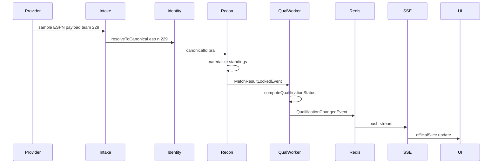
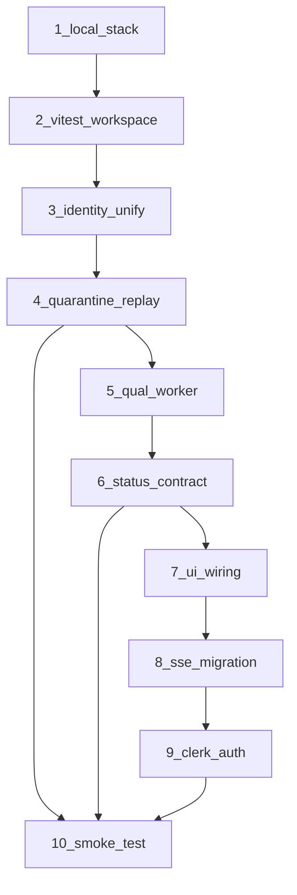

# Operational Readiness Fix Plan (v2)

**Goal:** Truthful, runnable, testable — correctness before polish.

**Repo reality check (path corrections from generic plan):**

| Generic reference | Actual path in this repo |
|-------------------|--------------------------|
| `apps/web/src/*` | [`src/`](src/) (Vite app at repo root, not `apps/web`) |
| Drizzle `db:push` | **Prisma** — [`prisma/schema.prisma`](prisma/schema.prisma), `npm run db:generate` / `db:push` |
| `packages/contracts/*` | [`packages/canonical`](packages/canonical), [`packages/events`](packages/events) |
| `packages/ui/*` | Analyst components in [`src/components/analyst/`](src/components/analyst/) |
| `server/src/infra/pushService.ts` | [`server/src/push/pushService.ts`](server/src/push/pushService.ts) |
| `apps/web/src/providers/SSEProvider.ts` | [`src/components/providers/SSEProvider.tsx`](src/components/providers/SSEProvider.tsx) |
| Kafka / NATS broker | **Not consumed locally today** — Redis streams + BullMQ only; skip broker until a consumer exists |
| `turbo.json` | **Does not exist** — optional later; pnpm workspace + root scripts sufficient for now |

**Auth decision (confirmed):** Clerk on correction/quarantine write APIs and `apps/admin`.

**Canonical team ID rule (confirmed):** Lowercase FIFA abbrev from catalog (e.g. `bra`); ESPN numeric (`229`) maps via `IdentityAlias` seed + `resolveCanonicalTeamId` on client.

---

## Phase 1: Make the base runnable

### 1.1 Create a working local stack

**Files**

- [`.env.example`](.env.example) — uncomment and document `DATABASE_URL`, `UPSTASH_REDIS_URL`, `CLERK_*`, provider keys
- `.env.local` (gitignored) — local values
- [`docker-compose.yml`](docker-compose.yml) — **new**: Postgres 16 + Redis 7
- [`package.json`](package.json) — add missing dev scripts
- [`docs/local-dev.md`](docs/local-dev.md) — **new**: startup sequence

**Steps**

1. Add Postgres (`5432`) and Redis (`6379`) to `docker-compose.yml`.
2. **No broker service** — no Kafka/NATS consumer in runtime; Redis handles streams (`wc2026:stream:*`) and BullMQ.
3. Keep existing Prisma scripts: `db:generate`, `db:push`, add `db:seed` → `node scripts/seed-identity.mjs --write`.
4. Add root scripts:
   - `web:dev` → alias existing `dev` (Vite)
   - `server:dev` → already exists
   - `worker:dev` → run reconciliation + qualification consumers from [`server/src/index.ts`](server/src/index.ts) or thin [`workers/*/index.ts`](workers/) entrypoints
5. Verify: `docker compose up -d && npm run db:push && npm run server:dev` connects to DB; health route returns quarantine depth.

**Patch checklist — `docker-compose.yml` (new)**

```yaml
services:
  postgres:
    image: postgres:16
    environment:
      POSTGRES_USER: wc2026
      POSTGRES_PASSWORD: wc2026
      POSTGRES_DB: wc2026
    ports: ["5432:5432"]
  redis:
    image: redis:7
    ports: ["6379:6379"]
```

**Patch checklist — `package.json` scripts**

```json
"web:dev": "vite",
"worker:dev": "node --experimental-vm-modules --loader ts-node/esm server/src/index.ts --workers-only",
"db:seed": "node scripts/seed-identity.mjs --write",
"test:all": "vitest run --workspace",
"verify:db": "node scripts/verify-db.mjs"
```

---

### 1.2 Verify workspace and test plumbing

**Files**

- [`pnpm-workspace.yaml`](pnpm-workspace.yaml) — already includes `packages/*`, `apps/*` ✓
- [`vitest.workspace.ts`](vitest.workspace.ts) — **new**
- [`vitest.config.ts`](vitest.config.ts) — shared coverage + aliases
- [`packages/identity/vitest.config.ts`](packages/identity/vitest.config.ts) — **new** (and one per package as needed)
- ~~`turbo.json`~~ — defer; not required for this sprint

**Steps**

1. Confirm workspace globs cover all packages (identity, qualification, prediction, canonical, events, db, zod-schemas).
2. Add root Vitest workspace referencing client + packages + server projects ([Vitest projects guide](https://vitest.dev/guide/projects)).
3. Move shared `coverage` config to root `vitest.config.ts`.
4. Fix current gap: only `src/**/*.test.ts` runs — [`packages/identity/src/identity.test.ts`](packages/identity/src/identity.test.ts) is excluded.
5. Root `npm run test:all` runs everything.

**Patch checklist — `vitest.workspace.ts` (new)**

```typescript
import { defineWorkspace } from "vitest/config";
export default defineWorkspace([
  "./vitest.config.ts",           // client: src/**
  "./packages/identity/vitest.config.ts",
  "./packages/qualification/vitest.config.ts",
  "./server/vitest.config.ts",
]);
```

---

## Phase 2: Fix identity first

### 2.1 Consolidate canonical identity into one package

**Highest-priority functional fix** — split paths today:

- [`packages/identity/src/index.ts`](packages/identity/src/index.ts) — injectable `IdentityService` + `IdentityRepository`
- [`server/src/bc1/identityService.ts`](server/src/bc1/identityService.ts) — **duplicate** Prisma-backed implementation (~400 lines)
- [`intakeWorker.ts`](server/src/bc1/intakeWorker.ts) — comment says identity handoff; **never calls it** (only Redis stream publish)

**Files to update**

- `packages/identity/src/prismaRepository.ts` — **new**
- `packages/identity/src/index.ts` — export factory `createIdentityService(repo)`
- [`server/src/bc1/identityService.ts`](server/src/bc1/identityService.ts) — **replace body** with re-export from `@wc2026/identity`
- [`server/src/bc1/reconciliationEngine.ts`](server/src/bc1/reconciliationEngine.ts) — require resolved canonical ID on input
- [`server/src/bc1/intakeWorker.ts`](server/src/bc1/intakeWorker.ts) or [`workers/reconciliation/index.ts`](workers/reconciliation/index.ts) — consumer resolves before reconcile
- Provider adapters: [`src/services/adapters/normalizeStandings.ts`](src/services/adapters/normalizeStandings.ts), [`src/services/espnMatchMerge.ts`](src/services/espnMatchMerge.ts) — already use client `resolveCanonicalTeamId`; server ingest must match via DB aliases
- [`scripts/seed-identity.mjs`](scripts/seed-identity.mjs) — write ESPN numeric → abbrev aliases (229 → bra)

**Steps**

1. `packages/identity` is the **only** resolver implementation.
2. Server imports package; delete duplicate fuzzy/quarantine logic from `server/src/bc1/identityService.ts`.
3. Every inbound team/match/venue/player passes `resolveToCanonical()` before `Canonical*` persistence.
4. Single mapping table: existing Prisma `IdentityAlias` ([`prisma/schema.prisma`](prisma/schema.prisma) L18).
5. Test: two provider IDs → one canonical row (see 2.2).

**Delete / deprecate**

- Duplicate methods in `server/src/bc1/identityService.ts` (keep thin re-export file for import stability).
- Any `prisma.canonicalTeam.create` using raw provider IDs without resolution.

**Patch checklist — `server/src/bc1/identityService.ts`**

```typescript
export { IdentityService, type ResolutionResult, type IdentityRepository } from "@wc2026/identity";
export { createIdentityService } from "@wc2026/identity";
import { prisma } from "../infra/prisma.js";
import { PrismaIdentityRepository, createIdentityService } from "@wc2026/identity";

export function createServerIdentityService() {
  return createIdentityService(new PrismaIdentityRepository(prisma));
}
```

---

### 2.2 Quarantine and correction flow

**Files**

- `packages/identity/src/quarantine.ts` — **extract** quarantine helpers from index (optional module split)
- [`server/src/bc1/rawEventLog.ts`](server/src/bc1/rawEventLog.ts) — link quarantine entries to `rawEventId`
- [`server/src/bc1/reconciliationEngine.ts`](server/src/bc1/reconciliationEngine.ts) — abort canonical write on quarantine
- [`server/src/bc1/correctionPipeline.ts`](server/src/bc1/correctionPipeline.ts) — replay after manual alias fix
- [`api/corrections/index.ts`](api/corrections/index.ts) — Phase 5 auth gate

**Steps**

1. Unresolved below fuzzy threshold → `IdentityQuarantine` row (already in schema).
2. Log raw payload + provider key via `RawEventLog` FK.
3. Correction endpoint for authorized users only (Clerk, Phase 5).
4. On quarantine resolve → replay raw event through reconciliation consumer.
5. `IdentityAuditLog` for every manual override (schema exists L56).

**Test — `packages/identity/src/splitId.test.ts`**

```typescript
// espn + "229" → bra; provider + "bra" → bra
// assert canonicalId equal; assert one CanonicalTeam row after reconcile
```

Extend [`src/lib/teamIdentityIntegration.test.ts`](src/lib/teamIdentityIntegration.test.ts) for client standings collapse (229 + bra → one points bucket).

---

## Phase 3: Make qualification deterministic

### 3.1 Replace simplified worker logic

**Problem:** [`server/src/bc2/qualificationWorker.ts`](server/src/bc2/qualificationWorker.ts) L415–499 defines inline `computeGroupQualification`, `getTier`, `getCertainty` — position-only approximation, not full rules.

**Files**

- [`server/src/bc2/qualificationWorker.ts`](server/src/bc2/qualificationWorker.ts) — delete inline functions; import package
- [`server/src/bc2/adaptQualificationInput.ts`](server/src/bc2/adaptQualificationInput.ts) — **new** DB → domain adapter
- [`packages/qualification/src/index.ts`](packages/qualification/src/index.ts) — already re-exports [`src/lib/qualification.ts`](src/lib/qualification.ts)
- [`src/lib/qualification.ts`](src/lib/qualification.ts) — source of truth (do not fork)
- [`src/lib/qualificationView.ts`](src/lib/qualificationView.ts) — display layer (keep separate)

**Steps**

1. Shared package is `@wc2026/qualification` (re-export bridge until full move completes).
2. Worker imports `buildQualificationContext`, `computeQualificationStatus`, `computeInputHash`.
3. Remove duplicate tiebreaker / tier logic from worker.
4. Feed both live and locked match sets through same `buildQualificationContext`.
5. Add regression tests (see below).

**Critical tests — `server/src/bc2/qualificationWorker.test.ts`**

| Case | Assert |
|------|--------|
| Top 2 in group | tier `qualified_top2` / display `qualified` |
| Third, top-8 among thirds | best-third path |
| Fourth, mathematically alive | not `eliminated` |
| ID mismatch (unresolved alias) | team not found / quarantined, not silent wrong tier |
| Live vs locked standings | same engine, different certainty |

---

### 3.2 Standardize status output

**Partially exists:** [`src/lib/qualificationView.ts`](src/lib/qualificationView.ts) already defines:

- Engine: `QualificationStatus` ([`src/types.ts`](src/types.ts))
- Display: `QualificationTierView` (`qualified` | `alive` | `projected_out` | `eliminated`)
- Mapping: `resolveQualificationDisplay` in [`src/lib/qualificationDisplay.ts`](src/lib/qualificationDisplay.ts)

**Files to formalize**

- [`packages/canonical/src/index.ts`](packages/canonical/src/index.ts) — add exported `QualificationEngineStatus` + `QualificationDisplayTier` types
- [`packages/events/src/index.ts`](packages/events/src/index.ts) — SSE/API event payloads use engine status only
- [`src/components/shared/QualificationStatusBadge.tsx`](src/components/shared/QualificationStatusBadge.tsx) — reads display layer, not raw worker tier strings
- [`src/components/analyst/OfficialQualificationPanel.tsx`](src/components/analyst/OfficialQualificationPanel.tsx) — BC2 official region uses engine status

**Steps**

1. Canonical engine enum in `packages/canonical`.
2. Display tier enum separate (already in `qualificationView.ts` — promote to canonical or re-export).
3. Map engine → display **only** in `qualificationView.ts` / `qualificationDisplay.ts`.
4. UI labels never read worker-internal tier strings (`CHAMPION`, `RUNNER_UP`) directly.
5. Test: display tier differs from engine status only when `resolveQualificationDisplay` says so.

---

## Phase 4: Wire the UI

### 4.1 Mount analyst panels

**Problem:** Components built in [`src/components/analyst/`](src/components/analyst/) but [`GroupsView.tsx`](src/components/views/GroupsView.tsx) does not import them.

**Files**

- [`src/components/views/GroupsView.tsx`](src/components/views/GroupsView.tsx)
- [`src/components/match/MatchScheduleCard.tsx`](src/components/match/MatchScheduleCard.tsx)
- [`src/pages/tournament/components/matches/TournamentMatchCard.tsx`](src/pages/tournament/components/matches/TournamentMatchCard.tsx) — optional second mount point
- [`src/store/slices/officialSlice.ts`](src/store/slices/officialSlice.ts), [`predictionSlice.ts`](src/store/slices/predictionSlice.ts) — data sources

**Steps**

1. Per selected group: render `OfficialQualificationPanel` (BC2) — **separate container** from prediction.
2. Beside/below: `AdvancementProbabilityPanel` (BC3).
3. `ScenarioBranchButton` in match card footer when group known.
4. Props from `computeQualificationStatus` + `predictionSlice` / `GET /api/teams/:id/advancement` — no mocks.
5. Hide duplicate polling-driven qual section once SSE slice populated (Phase 4.2).

**Patch sketch — `GroupsView.tsx`**

```tsx
import { OfficialQualificationPanel } from "../analyst/OfficialQualificationPanel";
import { AdvancementProbabilityPanel } from "../analyst/AdvancementProbabilityPanel";

// inside group detail / expanded row:
<OfficialQualificationPanel groupId={g} rows={officialRows} />
<AdvancementProbabilityPanel groupId={g} teams={predictionRows} />
```

---

### 4.2 Finish SSE migration

**Files**

- [`src/hooks/usePageVisibilityPolling.ts`](src/hooks/usePageVisibilityPolling.ts)
- [`src/lib/appLifecycle.ts`](src/lib/appLifecycle.ts) — starts [`PollingEngine`](src/services/PollingEngine.ts) unconditionally today
- [`src/components/providers/SSEProvider.tsx`](src/components/providers/SSEProvider.tsx)
- [`src/hooks/useServerPush.ts`](src/hooks/useServerPush.ts)
- [`api/events.ts`](api/events.ts)
- [`server/src/push/pushService.ts`](server/src/push/pushService.ts)

**Steps**

1. Add `VITE_SSE_PRIMARY=true` and `VITE_POLLING_FALLBACK=true` flags ([`src/config/apiFlags.ts`](src/config/apiFlags.ts)).
2. Polling runs only when SSE disconnected (expose `connected` from SSEProvider to store or `window.__sseConnected`).
3. Reconnect + heartbeat in `useServerPush` (verify existing behavior).
4. Staging: live updates without manual refresh.
5. Remove unconditional polling start once stable.

---

## Phase 5: Secure admin operations

### 5.1 Protect correction endpoints (Clerk)

**Files**

- [`server/src/middleware/clerkAuth.ts`](server/src/middleware/clerkAuth.ts) — **new**
- [`api/corrections/index.ts`](api/corrections/index.ts)
- [`api/identity/quarantine.ts`](api/identity/quarantine.ts)
- [`server/src/bc1/correctionPipeline.ts`](server/src/bc1/correctionPipeline.ts) — audit fields already expected
- [`apps/admin/src/main.tsx`](apps/admin/src/main.tsx) — `ClerkProvider`
- [`apps/admin/src/lib/rbac.ts`](apps/admin/src/lib/rbac.ts) — map Clerk `publicMetadata.role`

**Steps**

1. `@clerk/backend` JWT verify on Vercel handlers.
2. POST corrections requires `corrections:write`; resolve quarantine requires `identity:resolve`.
3. Sensitive overrides: require `data-admin` or higher (existing role matrix).
4. Record analystId, timestamp, reason (correction pipeline already accepts these).
5. Test: unauthenticated POST → 401.

---

## Phase 6: Prove it end to end

### 6.1 Smoke-test path

**Files**

- [`server/src/__tests__/smoke/ingestToQualification.test.ts`](server/src/__tests__/smoke/ingestToQualification.test.ts) — **new**
- [`scripts/smoke-e2e.mjs`](scripts/smoke-e2e.mjs) — **new** optional CLI wrapper
- [`api/health.ts`](api/health.ts) — preflight check
- [`server/src/index.ts`](server/src/index.ts) — worker startup

**Flow**



**Steps**

1. Ingest sample provider payload (fixture JSON, no live API).
2. Normalize → canonical entity via identity + reconciliation.
3. Recompute standings.
4. Recompute qualification via `@wc2026/qualification`.
5. Assert Redis push stream event emitted.
6. Assert UI read model (`fromQualificationStatus`) matches engine output.

Skip when `DATABASE_URL` unset (`describe.skipIf`).

---

## Personal / non-code tasks (you)

| Task | Decision |
|------|----------|
| Env values | Fill `.env.local` with real Postgres/Redis URLs after `docker compose up` |
| Broker | **Redis only** for this sprint — no Kafka/NATS until consumers exist |
| Canonical ID rule | Lowercase abbrev (`bra`); ESPN numerics via `IdentityAlias` |
| Clerk | **Now** (Phase 5) — keys in `.env.local` + Vercel |
| Smoke test | Run once after Phase 1 + 2 + 3 land |

---

## Highest-priority file checklist (start here)

1. [`.env.example`](.env.example)
2. [`docker-compose.yml`](docker-compose.yml) — create
3. [`packages/identity/*`](packages/identity/)
4. [`server/src/bc1/identityService.ts`](server/src/bc1/identityService.ts)
5. [`server/src/bc2/qualificationWorker.ts`](server/src/bc2/qualificationWorker.ts)
6. [`src/components/views/GroupsView.tsx`](src/components/views/GroupsView.tsx) *(not apps/web)*
7. [`src/components/match/MatchScheduleCard.tsx`](src/components/match/MatchScheduleCard.tsx)
8. [`api/corrections/index.ts`](api/corrections/index.ts)
9. [`vitest.workspace.ts`](vitest.workspace.ts) — create
10. [`package.json`](package.json)

---

## Implementation sequence



Phases 1–3 block everything else. UI wiring (4) can start once qual tests pass. Auth (5) can parallelize after corrections API shape is stable.

---

## Next deliverable

**File-by-file patch checklist with exact code edits** — ready to execute phase-by-phase on approval. Say **"execute the plan"** or **"start with Phase 1"** to begin implementation.

Each completed phase: `npm run version:build -- --message "..."` per workspace rules.
