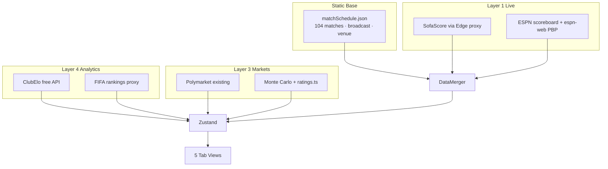

# PHASE 2 Architecture — Road to the World Cup Final 2026

**Status:** Locked · Discovery complete · Canonical plan: [`road_to_wc_final_5d0b0d99.plan.md`](/Users/RonalSorto/.cursor/plans/road_to_wc_final_5d0b0d99.plan.md)

---

## Product shape

A mobile-first 5-tab SPA that answers one question: *"Who's going to the final, and what's happening right now?"*

| Tab | Job |
|-----|-----|
| **Live** | Primary hero match + up to 3 secondary cards; qualification crest widgets |
| **Bracket** | Projected vs confirmed knockout; tap slot → team sheet |
| **Groups** | Standings + completed results + upcoming (with TV chips) |
| **Simulator** | Existing Monte Carlo editor — logic unchanged |
| **Teams** | Searchable 48-team roster with qualification filters |

Navigation: Zustand `activeTab` + [`useHashSync`](src/hooks/useHashSync.ts) (`yoursite.com/#groups`). No react-router.

---

## Data architecture (4 layers, $0 v1)



**Immutable rules:**
- Static JSON owns broadcast, venue, kickoff schedule, concurrent-match flags
- Live poll owns scores, status, clock, incidents
- Precedence: `manual > sofascore > espn > model`
- Link key: `M{matchNumber}` via `matchCompositeKey(teams, kickoff.utc)`
- Kickoff display: always `Intl.DateTimeFormat` on `kickoff.utc`

**v2 stubs (no-op until `.env` keys):** TheStatsAPI, The Odds API, Betfair, Schedules Direct

---

## Core services

| Service | Responsibility |
|---------|----------------|
| [`Logger.ts`](src/services/Logger.ts) | Structured logs → `window.__appLogs` |
| [`PollingEngine.ts`](src/services/PollingEngine.ts) | Singleton; 15s live / 5min idle; `batchPollUpdate` |
| [`DataMerger.ts`](src/services/DataMerger.ts) | `applyLiveScore`, `mergeMatchEvents`, `reconcileScoreAndEvents` |
| [`SofaScoreClient.ts`](src/services/SofaScoreClient.ts) | Primary live source |
| [`ESPNClient.ts`](src/services/ESPNClient.ts) | Fallback + play-by-play |
| [`BroadcastLookup.ts`](src/services/BroadcastLookup.ts) | Index `matchSchedule.json` → USA TV chips |
| [`ClubEloClient.ts`](src/services/ClubEloClient.ts) | Free ELO ratings |
| [`SimulationScheduler.ts`](src/services/SimulationScheduler.ts) | 10k worker / 4.2k main cap |

---

## State (Zustand slices)

- **matchSlice** — `liveMatches`, `matchEvents`, `batchPollUpdate`, `sofaEventId` cache
- **tournamentSlice** — teams, bracket `{projected, confirmed}`, `deriveStandings`
- **simulationSlice** — `simulationResult`, `simulationRunning`, seed
- **uiSlice** — `activeTab`, `splashPhase`, `primaryLiveMatchId`, sheet state

Qualification status: **derived selectors only** — never written to store. [`useQualificationChangeLogger`](src/hooks/useQualificationChangeLogger.ts) logs tier transitions via ref differ.

---

## Bootstrap sequence

```
loading → [ESPN critical 8s] → enriching [SofaScore+Poly+FIFA allSettled] → simulation [worker] → done
         ↘ slow (>2s warning)
         ↘ error (SplashErrorCard + full retry)
Min splash: 1200ms · PollingEngine.start() after fade
```

---

## Build sequence (15 prompts)

| # | Deliverable | Key files |
|---|-------------|-----------|
| 0 | Logger + window.d.ts | `Logger.ts`, `types/window.d.ts` |
| 1 | Zustand store | `store/slices/*`, `store/index.ts` |
| 2 | Types + static data | `types.ts`, `matchSchedule.json`, `BroadcastLookup.ts` |
| 3 | Live pipeline | `PollingEngine`, `DataMerger`, `SofaScoreClient`, `ESPNClient`, v2 stubs |
| 4 | Qualification | `qualification.ts`, selectors, `useQualificationChangeLogger` |
| 5 | Live hero UI | `LiveMatchBento`, `LiveView` |
| 6 | Bracket UI | `BracketBento`, `BracketView` |
| 7 | Qual widgets | `QualifiedBento`, `EliminatedBento`, `BestThirdsBento` |
| 8 | Team sheet | `TeamDetailSheet` (Now/Path/Odds + ClubElo) |
| 9 | Design system | Split CSS, WCAG tokens, PWA meta |
| 10 | Edge proxies | `api/*`, `/espn-web/` |
| 11 | App shell | `AppShell`, tab bar, `useHashSync` |
| 12 | Splash | `SplashScreen` loading/slow/error |
| 13 | Tests | 6 vitest suites (Fixes 1–18) |
| 14 | Groups | `GroupsView` + `historySelectors` |
| 15 | Teams | `TeamsView` search + filter |

**One-time manual step (Prompt 2):** Copy [`fifa_wc2026_complete_v2.json`](/Users/RonalSorto/Downloads/fifa_wc2026_complete_v2.json) → `src/data/matchSchedule.json`

---

## Preserved from current app

[`ratings.ts`](src/lib/ratings.ts) · [`predictions.ts`](src/lib/predictions.ts) · [`tournament.ts`](src/lib/tournament.ts) · [`thirdPlaceMap.ts`](src/data/thirdPlaceMap.ts) · [`knockoutSchedule.ts`](src/data/knockoutSchedule.ts) · `STORAGE_KEY` / `PICKS_KEY` localStorage · `@vercel/analytics`

---

## Launch checklist (acceptance)

- 15s poll with single `batchPollUpdate` per cycle
- Splash never hangs on ESPN failure
- `#bracket` deep link restores tab
- USA TV chips on live/upcoming matches
- Simulator Monte Carlo matches today's behavior
- 6 vitest suites green
- Safari 320px + 3G throttle QA

---

## To start implementation

Say **`execute the plan`** — begins Phase 0 + Prompt 1 (Logger + Zustand foundation).
