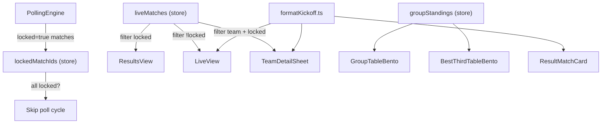

# Results Tab + Finals Badge + Groups Table Toggle

## Pre-implementation notes

Three items in the spec are **already done** and will be skipped:

- Phase 1.2 — `bootstrap.ts` already wraps `runCalibration` in try/catch and calls `deriveStandingsIfScored` (returns null-guarded value)
- Phase 1.4 — `SimulationScheduler.ts` already uses `import.meta.env.PROD` for worker selection (line 93)
- Phase 1.5 — `hydrateFromBootstrap` in `tournamentSlice.ts` already uses `derived ?? get().groupStandings`
- Phase 7 — `AppShell.tsx` already uses `inert` attribute, not `aria-hidden`

**CSS note:** The spec says CSS Modules, but the repo uses global CSS files (`app-views.css`, `app.css`, `layout.css`). All new styles will follow the existing global CSS convention. No `.module.css` files will be created.

**Set serialization note:** Zustand devtools middleware serializes state to JSON, which cannot represent `Set`. `lockedMatchIds` will be typed as `Set<string>` but stored as `Record<string, true>` internally for devtools compatibility. The public API will accept/return `Set<string>` via selector.

---

## Phase 1 — Store & Data Layer

### [`src/store/slices/uiSlice.ts`](src/store/slices/uiSlice.ts)
Add two new fields:
- `groupsViewMode: "flags" | "table"` — default `"flags"`
- `setGroupsViewMode(mode: "flags" | "table"): void`
Update `UiSliceState` type and implementation.

### [`src/store/slices/matchSlice.ts`](src/store/slices/matchSlice.ts)
Add two new fields:
- `lockedMatchIds: Record<string, true>` — default `{}`
- `addLockedMatchId(id: string): void` — merges `{ [id]: true }` into state

Export a helper `getLockedSet(state: MatchSliceState): Set<string>` as a selector utility.

### [`src/types.ts`](src/types.ts)
- Add `"results"` to `TabId` union: `"live" | "results" | "bracket" | "groups" | "simulator" | "teams"`

### [`src/services/PollingEngine.ts`](src/services/PollingEngine.ts)
In `fetchAndMerge()`: after building `merged`, iterate matches and call `store.addLockedMatchId(m.id)` for any `m.locked === true`.

In `poll()`: before `fetchAndMerge()`, check if every match in `store.liveMatches` has its ID in `store.lockedMatchIds`. If all locked, log `"All matches locked — polling paused"` and call `scheduleNext()` without fetching.

---

## Phase 2 — Kickoff Time Utility

### New file: [`src/lib/formatKickoff.ts`](src/lib/formatKickoff.ts)

```typescript
// Three exported functions using browser-local timezone (no hardcoded TZ)
export function formatKickoff(isoDate: string, isCompleted?: boolean): string
// "Wed, Jun 25 · 3:00 PM"  —  date only for completed: "Wed, Jun 25"

export function formatKickoffTime(isoDate: string): string
// "3:00 PM"  —  12-hour, local TZ

export function formatKickoffDate(isoDate: string): string
// "Wed, Jun 25"

// All three: return empty string "" on invalid input (no throws)
```

Uses `Intl.DateTimeFormat` throughout. No new dependencies.

### New file: [`src/lib/formatKickoff.test.ts`](src/lib/formatKickoff.test.ts)
Vitest tests covering:
- UTC ISO → browser-local conversion produces expected time segment
- `isCompleted=true` strips the time portion
- Output is 12-hour format (contains AM/PM, no 13:00-style output)
- Empty string / non-date input returns `""` gracefully

---

## Phase 3 — Results Tab

### [`src/types.ts`](src/types.ts) (continued from Phase 1)
`TabId` already updated above.

### [`src/hooks/useHashSync.ts`](src/hooks/useHashSync.ts)
Add `"results"` to `VALID_TABS` array.

### New file: [`src/components/views/ResultsView.tsx`](src/components/views/ResultsView.tsx)
- Reads `liveMatches` from Zustand, filters to `m.locked === true`
- Groups by round using this priority:
  - Group stage: section per group ("Group A — Matchday 1", derived from `match.group` + ascending date ordering)
  - Knockout stages in order: R32 → R16 → QF → SF → Third Place → Final (from `match.stage`)
- Each section: heading + list of `ResultMatchCard` components, newest first
- Empty state: `"No results yet — check back after matches are played"`

### New file: [`src/components/match/ResultMatchCard.tsx`](src/components/match/ResultMatchCard.tsx)
Props: `{ match: MergedMatch }`
- Layout: home flag+name | score (bold) | away flag+name
- Neutral `"FINAL"` pill badge (gray, not red/green)
- Date via `formatKickoffDate(match.date)` — no time
- `onClick`: calls `store.openTeamSheet(match.homeTeamId)` (consistent with existing behavior)
- `role="article"`, `aria-label="TeamA N–N TeamB, Final"`

### [`src/components/layout/BottomTabBar.tsx`](src/components/layout/BottomTabBar.tsx)
Insert `{ id: "results", label: "Results" }` after `"live"` in the `TABS` array. Tab order becomes: Live → Results → Groups → Bracket → Teams → Simulator.

### [`src/components/layout/AppShell.tsx`](src/components/layout/AppShell.tsx)
Add import and conditional render:
```typescript
import { ResultsView } from "../views/ResultsView";
// ...
{activeTab === "results" ? <ResultsView /> : null}
```

---

## Phase 4 — Live Tab Cleanup

### [`src/components/views/LiveView.tsx`](src/components/views/LiveView.tsx)
- Change `allMatches` derivation to exclude locked/completed matches:
  ```typescript
  const allMatches = useMemo(
    () => Object.values(liveMatchesMap).filter((m) => !m.locked && m.status !== "completed"),
    [liveMatchesMap]
  );
  ```
- For `todaySchedule` scheduled cards: replace raw `formatKickoffLabel` in `MatchScheduleCard` with `formatKickoffTime(match.date)` — but since `MatchScheduleCard` internally calls `formatKickoffLabel`, the cleanest fix is to pass a `timeLabel` prop override or update `MatchScheduleCard` to accept a display override. **Decision:** update `LiveView` to use the existing `MatchScheduleCard` as-is (it already calls `formatKickoffLabel`); the filtering change is the key deliverable here. The time display will use Phase 2's `formatKickoffTime` if `MatchScheduleCard` is updated.
- Update the "no live matches" empty state text: `"No live matches right now. Check the Results tab for completed matches or the schedule for upcoming kickoffs."`

---

## Phase 5 — Groups Tab: Flags / Table Toggle

### [`src/components/views/GroupsView.tsx`](src/components/views/GroupsView.tsx)
- Read `groupsViewMode` and `setGroupsViewMode` from Zustand
- Add segmented control at top of view (two buttons: "Flags" / "Table")
- Conditionally render:
  - `groupsViewMode === "flags"`: existing standings grid + results + upcoming (no changes)
  - `groupsViewMode === "table"`: `GroupTableBento` per group + `BestThirdTableBento`

### New file: [`src/components/bentos/GroupTableBento.tsx`](src/components/bentos/GroupTableBento.tsx)
Props: `{ standing: GroupStanding }`

Columns: `# | Team | MP | W | D | L | GF | GA | GD | Pts`
- Team column: flag img + short name
- Sort: Pts DESC → GD DESC → GF DESC (H2H not available in `TeamRecord` — noted deviation; H2H is out of scope without a dedicated H2H resolver)
- Row classes: top-2 rows get green left-border accent, row 3 gets yellow, row 4 gets 50% opacity
- Data from `groupStandings` in Zustand

### New file: [`src/components/bentos/BestThirdTableBento.tsx`](src/components/bentos/BestThirdTableBento.tsx)
Props: `{ standings: GroupStanding[] }`

Uses `rankBestThirds(standings)` from `src/lib/bestThirds.ts` (already exists) to get the 6 third-place teams ranked.

Columns: `# | Team | Pts | GD | GF | W | H2H | Discipline`

Column notes:
- GD: `+/-` prefix, green if positive, red if negative, gray if zero
- H2H: derived from `liveMatches` filtered to locked group-stage matches between third-place teams. Show "W"/"D"/"L"/"N/A" badge (green/yellow/red/gray)
- Discipline: yellow cards = -1 each, red = -4, YR = -5. Derived from `match.homeConduct` / `match.awayConduct` fields on locked group matches. Color: green=0, yellow=-1 to -3, red=-4+
- Top 4: green left-border; rows 5–6: 50% opacity
- Wrapper: `overflow-x: auto`; table: `min-width: 480px`
- Legend below table explaining H2H and Discipline

Add styles for all new table components to [`src/styles/app-views.css`](src/styles/app-views.css).

---

## Phase 6 — Team Card: Past Performance

### [`src/components/team-detail/TeamDetailSheet.tsx`](src/components/team-detail/TeamDetailSheet.tsx)
In the `tab === "now"` panel, add a "Match History" section:
- Reads `liveMatches` from store
- Filters: `(m.homeTeamId === teamId || m.awayTeamId === teamId) && m.locked === true`
- Sorts by `m.date` DESC
- Renders a compact row per match: opponent flag+name | score | W/D/L badge | `formatKickoffDate(m.date)`
- W/D/L is from this team's perspective; badge: green=W, gray=D, red=L
- Empty state: `"No completed matches yet"`
- Uses `formatKickoffDate` from Phase 2

---

## Data Flow Overview



---

## Files Summary

| Phase | Files Created | Files Modified |
|---|---|---|
| 1 | — | `uiSlice.ts`, `matchSlice.ts`, `types.ts`, `PollingEngine.ts` |
| 2 | `formatKickoff.ts`, `formatKickoff.test.ts` | — |
| 3 | `ResultsView.tsx`, `ResultMatchCard.tsx` | `useHashSync.ts`, `BottomTabBar.tsx`, `AppShell.tsx`, `types.ts` |
| 4 | — | `LiveView.tsx` |
| 5 | `GroupTableBento.tsx`, `BestThirdTableBento.tsx` | `GroupsView.tsx`, `app-views.css` |
| 6 | — | `TeamDetailSheet.tsx` |
| 7 | — | (already done) |