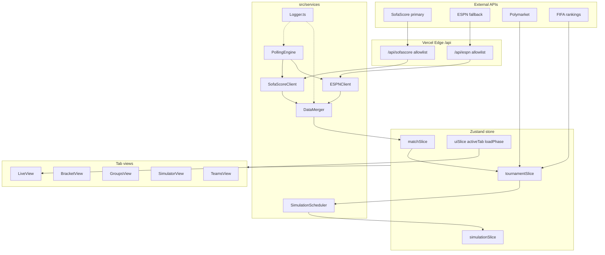
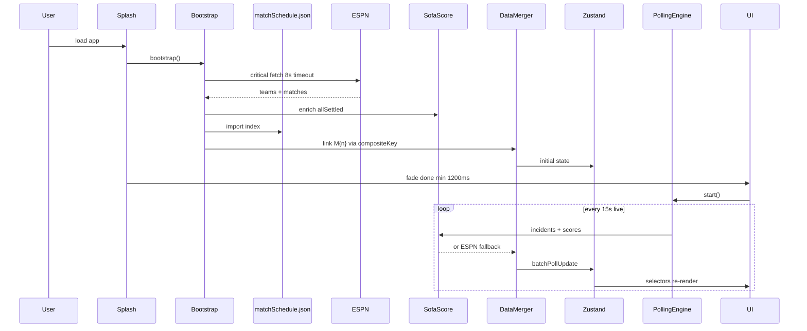
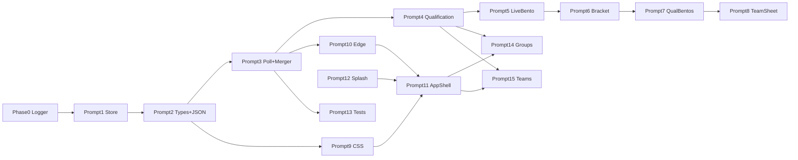

# Road to the World Cup Final 2026 — Architecture (PHASE 2 LOCKED)

> **Status:** Discovery complete · Architecture locked 2026-06-25 · Ready for implementation  
> **Start build:** Say `execute the plan` to run Prompt 1

## Architecture decision record (ADR summary)

| ID | Decision | Rationale |
|----|----------|-----------|
| ADR-01 | SofaScore primary, ESPN fallback | Free; incidents + clock; ESPN play-by-play via `/espn-web/` |
| ADR-02 | `matchSchedule.json` static base (~1 MB) | All 104 matches, broadcast, venue — no manual entry |
| ADR-03 | `$0 API budget v1 | Polymarket + ClubElo + FIFA only; paid APIs stubbed |
| ADR-04 | No react-router | `activeTab` + `useHashSync` (`#groups`, etc.) |
| ADR-05 | Qualification derived, never stored | Ref-based change logger; selectors only |
| ADR-06 | `manual > sofascore > espn > model` | Immutable score precedence |
| ADR-07 | Simulator tab preserves App.tsx logic | Extract verbatim; zero model changes |
| ADR-08 | 10k worker / 4,200 main-thread cap | Fix 16 — no UI jank on mobile |
| ADR-09 | v2 stubs for paid APIs | TheStatsAPI, Odds API, Betfair, Schedules Direct |

---

# Implementation Plan

## Current state vs target

| Area | Today ([`src/App.tsx`](src/App.tsx) ~1,336 lines) | Target |
|------|--------------------------------------------------|--------|
| Structure | Flat: `lib/`, single `styles.css`, no `api/` | 47-file layout per blueprint |
| State | React `useState` + `localStorage` | Zustand slices + existing override keys |
| Live data | One-shot `loadWorldCupData()` on mount | `PollingEngine` (15s live / 5min idle) |
| UI | Tournament + Probabilistic tabs + Methodology | 5-tab SPA: Live, Bracket, Groups, Simulator, Teams |
| Navigation | None (single page) | `activeTab` in Zustand + **`useHashSync`** (`#groups`, etc.) — no react-router |
| First load | One-shot fetch, loading spinner | Branded splash + 4-phase progressive load (min 1200ms) |
| Observability | console only | `Logger.ts` + dev `DebugPanel` + `window.__appLogs` |
| Proxies | Vite + Vercel rewrites (`/espn`, `/poly`, `/fifa-api`) | Add `/api/*` Edge Functions with allowlists |
| Monte Carlo | 4,200 iterations ([`App.tsx:41`](src/App.tsx)) | 10,000 worker-only; 4,200 main-thread cap |
| Testing | None | vitest — 6 suites (Fix 18 / Prompt 13) |

**Preserved unchanged (merge strategy):**
- [`src/lib/ratings.ts`](src/lib/ratings.ts), [`src/lib/predictions.ts`](src/lib/predictions.ts) — core model
- [`src/lib/tournament.ts`](src/lib/tournament.ts) — bracket engine, `projectTournament`, `simulateTournamentOutcomes`
- [`src/data/thirdPlaceMap.ts`](src/data/thirdPlaceMap.ts) — 495-combo matrix (keep TS import; JSON migration optional later)
- [`src/data/knockoutSchedule.ts`](src/data/knockoutSchedule.ts) — venue/date metadata
- Manual score overrides (`STORAGE_KEY`) and bracket picks (`PICKS_KEY`) — wired into **Simulator tab** + simulation inputs
- Methodology content — accessible from **Simulator tab** via `MethodView.tsx` (extracted from App.tsx)

---

## Architecture (confirmed decisions)



**Live source priority (per your choice):** SofaScore > ESPN. On SofaScore 403/timeout, fall back to ESPN for score + clock; incidents from ESPN `summary`/`plays` when SofaScore incidents fail.

**SofaScore risk mitigations (required, not optional):**
- Path allowlist in [`api/sofascore.ts`](api/sofascore.ts): only `/sport/football/`, `/event/{id}`, `/event/{id}/incidents`
- Rate limit: max 1 request per match per poll cycle; global cap ~20 req/min
- Map SofaScore ↔ ESPN via [`matchCompositeKey()`](src/lib/normalize.ts): `pairKey(teamA, teamB) + '__' + UTC-noon dateKey` — order-independent; never numeric cross-IDs
- Source precedence (immutable): **manual > sofascore > espn > model**
- Staleness banner when both sources fail; never blank scores (carry forward last-known-good)

---

## Master API stack (architect discovery — locked 2026-06-25)

**Budget:** $0 hard cap at v1 launch. Paid APIs deferred to v2 with stub hooks in UI/services.

### v1 data layers (ship at launch)

```
┌─────────────────────────────────────────────────────────────┐
│  STATIC BASE — matchSchedule.json (104 matches, ~1 MB)      │
│  kickoff.utc, venue, broadcast.USA, concurrent flags        │
├─────────────────────────────────────────────────────────────┤
│  LAYER 1 — Live scores, clock, incidents                    │
│  PRIMARY:   SofaScore (via Vercel Edge proxy)               │
│  FALLBACK:  ESPN scoreboard + /espn-web/ play-by-play       │
├─────────────────────────────────────────────────────────────┤
│  LAYER 2 — Broadcast (USA networks only)                    │
│  PRIMARY:   Static from matchSchedule.json                  │
│  (FOX/FS1 + Telemundo/Universo + streaming list)            │
├─────────────────────────────────────────────────────────────┤
│  LAYER 3 — Odds & prediction markets                        │
│  PRIMARY:   Polymarket (existing — winner + per-match)      │
│  MODEL:     Monte Carlo + ratings.ts (Simulator / Odds tab) │
├─────────────────────────────────────────────────────────────┤
│  LAYER 4 — Analytics (free only)                            │
│  PRIMARY:   ClubElo API (clubelo.com/API — no auth)         │
│  SECONDARY: FIFA rankings (existing fifa-api proxy)           │
│  MODEL:     xG-style outputs from simulation, not live xG   │
└─────────────────────────────────────────────────────────────┘
```

### v2 deferred layers (stub now, wire when keys/budget added)

| Layer | Provider | Cost | v2 trigger |
|-------|----------|------|------------|
| Live deep stats | TheStatsAPI match centre (lineups, xG, shotmap) | ~$50/mo | User adds `THESTATS_API_KEY` |
| Local affiliates | Schedules Direct zip → FOX/Telemundo channel | ~$25/yr | Settings zip + `SD_USERNAME`/`SD_PASSWORD` |
| Sportsbook odds | The Odds API (DraftKings, FanDuel, etc.) | from $49/mo | `ODDS_API_KEY` in Edge env |
| Prediction market | Betfair Exchange implied prob | account | `BETFAIR_SESSION_TOKEN` |
| Live fallback | API-Football / football-data.org | free tier | Only if SofaScore+ESPN both fail persistently |

**Explicitly NOT in v1:** TheStatsAPI polling, The Odds API, Betfair, Schedules Direct, API-Football.

### Data merge contract

Static `matchSchedule.json` is **source of truth** for: broadcast channels, venue, concurrent-match flags, placeholder team labels, kickoff schedule.

Live poll **overwrites** (via `DataMerger.applyLiveScore`, precedence `manual > sofascore > espn > model`):
- Scores, status, clock period, incidents/events
- Team names as knockout placeholders resolve (from SofaScore/ESPN)

**Never overwritten from poll:** `broadcast.*`, `venue` (static unless ESPN provides correction — log only)

**Link key:** `M{matchNumber}` ↔ live event via `matchCompositeKey(teamA, teamB, kickoff.utc)` + `sofaEventId` cache.

```typescript
// Enrichment pattern (bootstrap + each poll cycle)
function enrichMatch(staticEntry: MatchScheduleEntry, live: MergedMatch | null): EnrichedMatch {
  return {
    ...staticEntry,                    // broadcast, venue, kickoff.utc base
    matchId: `M${staticEntry.matchNumber}`,
    live: live ?? null,                // scores/status from SofaScore/ESPN
    odds: polymarketForMatch(staticEntry), // existing Polymarket index
    elo: clubEloCache.get(staticEntry.homeTeam), // lazy ClubElo fetch
  };
}
```

### Kickoff rendering (all layers)

Always render from `kickoff.utc` — never pre-converted ET/PT strings from JSON:

```typescript
new Intl.DateTimeFormat(undefined, { dateStyle: 'full', timeStyle: 'short' })
  .format(new Date(match.kickoff.utc));
```

### v2 service stubs (create in Prompt 3, no-op until keys present)

| File | Purpose |
|------|---------|
| `TheStatsAPIClient.ts` | `getMatchCentre(id)` — returns null without key |
| `OddsAPIClient.ts` | `getMatchOdds()` — returns null without key |
| `BetfairClient.ts` | `getImpliedProbability()` — returns null without key |
| `SchedulesDirectClient.ts` | `getLocalChannels(zip)` — returns null without credentials |

TeamDetailSheet Odds tab: show Polymarket + model today; reserved rows for "Sportsbook consensus" and "Betfair" with `—` until v2 keys configured.

### ClubElo integration (v1, Prompt 8)

- `GET http://api.clubelo.com/{TeamName}` — map FIFA team names to ClubElo slugs in `src/data/clubEloSlugs.ts`
- Cache in memory + `localStorage` 24h TTL
- Surface in TeamDetailSheet Path tab and TeamsView row as supplementary rating
- **CORS note:** ClubElo may require Edge proxy if browser-blocked — add `api/clubelo.ts` allowlist if needed

### Architect note — resolved tensions

| User first pick | Final resolution |
|-----------------|----------------|
| Full odds stack v1 | **Polymarket only** ships; Odds API + Betfair stubbed for v2 |
| Full analytics v1 | **ClubElo + FIFA + Monte Carlo** — no TheStatsAPI |
| Free-only budget | Hard $0 cap confirmed |
| TheStatsAPI as Layer 1 | **Rejected** — keep SofaScore + ESPN |

Say **PHASE 2: COMMENCE ARCHITECTURE** when ready to lock this into the 15-prompt build sequence.

---

## Target directory structure (PHASE 2)

```
world-cup/
├── api/
│   ├── sofascore.ts          # allowlisted proxy
│   ├── espn.ts
│   ├── polymarket.ts
│   ├── fifa.ts
│   └── clubelo.ts            # if CORS blocked
├── public/
│   ├── manifest.json
│   ├── og-image.png
│   └── icons/*
├── src/
│   ├── main.tsx              # bootstrap() + splash orchestration
│   ├── App.tsx               # ~50 lines: AppShell only
│   ├── types.ts              # extended unions
│   ├── types/window.d.ts
│   ├── data/
│   │   ├── matchSchedule.json    # copy fifa_wc2026_complete_v2.json
│   │   ├── clubEloSlugs.ts
│   │   ├── knockoutSchedule.ts   # preserved
│   │   └── thirdPlaceMap.ts      # preserved
│   ├── store/
│   │   ├── index.ts
│   │   ├── slices/{match,tournament,simulation,ui}Slice.ts
│   │   └── selectors/{qualification,bestThirds,bracket,opponent,history}Selectors.ts
│   ├── services/
│   │   ├── Logger.ts
│   │   ├── PollingEngine.ts
│   │   ├── DataMerger.ts
│   │   ├── SofaScoreClient.ts
│   │   ├── ESPNClient.ts
│   │   ├── BroadcastLookup.ts
│   │   ├── SimulationScheduler.ts
│   │   ├── ClubEloClient.ts
│   │   └── stubs/            # v2 no-op until keys
│   │       ├── TheStatsAPIClient.ts
│   │       ├── OddsAPIClient.ts
│   │       ├── BetfairClient.ts
│   │       └── SchedulesDirectClient.ts
│   ├── hooks/
│   │   ├── useLiveClock.ts
│   │   ├── useHashSync.ts
│   │   ├── useQualificationChangeLogger.ts
│   │   ├── usePollingStatus.ts
│   │   ├── useBreakpoint.ts
│   │   └── useTeamDetailSheet.ts
│   ├── lib/                  # preserved + extended
│   │   ├── qualification.ts
│   │   ├── bestThirds.ts
│   │   ├── normalize.ts
│   │   ├── tournament.ts
│   │   ├── predictions.ts
│   │   ├── ratings.ts
│   │   └── dataSources.ts
│   ├── components/
│   │   ├── layout/{AppShell,SplashScreen,BottomTabBar,TopNavBar}.tsx
│   │   ├── views/{Live,Bracket,Groups,Simulator,Teams}View.tsx
│   │   ├── bentos/{LiveMatch,Bracket,Qualified,Eliminated,BestThirds}Bento.tsx
│   │   ├── team-detail/TeamDetailSheet.tsx
│   │   ├── simulator/{SimulatorView,MethodView,ScoreEditor}.tsx
│   │   └── shared/{DebugPanel,BentoErrorCard,ErrorBoundary}.tsx
│   ├── styles/{tokens,typography,layout,animations,components,mobile}.css
│   └── workers/simulationWorker.ts
├── vercel.json
└── vite.config.ts
```

## Runtime data flow (PHASE 2)



## Environment variables

| Variable | Required v1 | Purpose |
|----------|-------------|---------|
| `POLYMARKET_API_KEY` | Optional | Existing poly proxy |
| `THESTATS_API_KEY` | No | v2 match centre |
| `ODDS_API_KEY` | No | v2 sportsbook odds |
| `BETFAIR_SESSION_TOKEN` | No | v2 prediction market |
| `SD_USERNAME` / `SD_PASSWORD` | No | v2 Schedules Direct |
| `VITE_BUILD_VERSION` | Dev | Logger + DebugPanel |

## New npm dependencies (Prompt 1)

- `zustand` — store
- `vitest` + `@vitest/coverage-v8` — Prompt 13 (dev)

## Prompt dependency graph



**Parallelizable after Prompt 4:** Prompts 5–8 (bentos), 9 (CSS), 10 (edge), 13 (tests) can run in separate sessions.

---

## Production-hardening fix registry (Fixes 1–18)

All audit gaps are **closed** with precise implementation contracts below. Cursor Prompts 3–4 and 13 must implement these verbatim.

| # | Gap | Owner | Severity |
|---|-----|-------|----------|
| 1 | Composite key order-sensitive | [`normalize.ts`](src/lib/normalize.ts) — `matchCompositeKey` | Critical |
| 2 | UTC date boundary drift | `normalize.ts` — `setUTCHours(12)` in key | Critical |
| 3 | `sofaEventId` not stored | [`types.ts`](src/types.ts) + [`DataMerger.ts`](src/services/DataMerger.ts) | Critical |
| 4 | Manual override stomped | `DataMerger.ts` — `applyLiveScore` | Critical |
| 5 | Multi-match primary selection | [`PollingEngine.ts`](src/services/PollingEngine.ts) — `selectPrimaryMatch` | Critical |
| 6 | Clock missing periods | [`useLiveClock.ts`](src/hooks/useLiveClock.ts) — full `MatchPeriod` model | Critical |
| 7 | Event deduplication | [`matchSlice.ts`](src/store/slices/matchSlice.ts) — `providerId` + `mergeMatchEvents` | Critical |
| 8 | `eliminationProbability` undefined | [`qualification.ts`](src/lib/qualification.ts) — logistic formula | High |
| 9 | Standings duplicated | `qualification.ts` imports `computeStandings` only | High |
| 10 | SofaScore conduct | [`SofaScoreClient.ts`](src/services/SofaScoreClient.ts) + `mergeConductScores` | High |
| 11 | Postponed/interrupted | [`types.ts`](src/types.ts) + `PollingEngine.updateLiveMatchIds` | High |
| 12 | ESPN summary proxy | [`vercel.json`](vercel.json) + [`vite.config.ts`](vite.config.ts) — `/espn-web/*` | High |
| 13 | StrictMode double-start | `PollingEngine` singleton + idempotent `start()` | High |
| 14 | Thundering herd on goals | `matchSlice.batchPollUpdate` + optional `unstable_batchedUpdates` wrapper | Medium |
| 15 | `groupStageComplete` undefined | [`tournamentSlice.ts`](src/store/slices/tournamentSlice.ts) — exactly 72 group matches | Medium |
| 16 | Monte Carlo main-thread jank | [`SimulationScheduler.ts`](src/services/SimulationScheduler.ts) — cap 4,200 | Medium |
| 17 | Dual standings paths | [`tournament.ts`](src/lib/tournament.ts) — single `deriveStandings` | Medium |
| 18 | No unit tests | [`src/**/*.test.ts`](src/) — 6 test suites (Prompt 13) | Medium |

### Fix 1–2 — `matchCompositeKey` (order-independent + UTC noon)

```typescript
// src/lib/normalize.ts
export function matchCompositeKey(teamA: string, teamB: string, dateISO: string): string {
  const utcNoon = new Date(dateISO);
  utcNoon.setUTCHours(12, 0, 0, 0);
  const dateKey = utcNoon.toISOString().slice(0, 10);
  return `${pairKey(normalizeName(teamA), normalizeName(teamB))}__${dateKey}`;
}
// SofaScore dates: convert startTimestamp (unix sec) to ISO before calling
```

### Fix 3 — `MergedMatch` + cached `sofaEventId`

```typescript
export type MergedMatch = LiveMatch & BroadcastInfo & {
  sofaEventId: number | null;
  compositeKey: string;
  dataSource: 'sofascore+espn' | 'espn-only' | 'sofascore-only';
  sofaLinkedAt: number | null;
};
// mergeMatchSources: if existingMerged?.sofaEventId → skip search; else link by compositeKey
```

### Fix 4 — Source precedence + `applyLiveScore`

```typescript
export type SourceKind = 'espn' | 'sofascore' | 'polymarket' | 'model' | 'manual';
// PRECEDENCE: manual > sofascore > espn > model
// manual never overwritten by poll; cleared only via resetManualOverride(matchId)
export function applyLiveScore(existing, incoming, source): MergedMatch { /* guard manual; espn cannot beat sofascore on score */ }
```

### Fix 5 — `selectPrimaryMatch` algorithm

Priority when user has not pinned `primaryLiveMatchId`:
1. Most recent goal minute
2. Furthest clock minute
3. Highest combined team ratings (prestige)
4. Chronological kickoff fallback

Respect user `primaryLiveMatchId` until that match ends; then auto-promote by above rules.

### Fix 6 — `useLiveClock` + `computeDisplay`

`MatchPeriod`: `not_started` | `first_half` | `half_time` | `second_half` | `extra_time_first` | `extra_time_break` | `extra_time_second` | `penalties` | `full_time` | `postponed` | `interrupted`

Display: `67'`, `90+3'`, `HT`, `103' AET`, `PENS`, `FT`, `PST`, `INT` — RAF only when period is running; `visibilitychange` wall-clock resync.

### Fix 7 — `MatchEvent` + dedup

```typescript
export type MatchEvent = {
  providerId: string;  // dedup key — SofaScore incident id
  espnEventId?: string;
  minute: number; minuteExtra?: number;
  type: 'goal' | 'own_goal' | 'yellow_card' | 'red_card' | 'yellow_red_card' |
        'substitution' | 'var_review' | 'goal_disallowed' | 'penalty_missed' | 'penalty_saved';
  teamId: string; playerName: string; assistName?: string;
  isVarReviewed?: boolean; varOutcome?: 'confirmed' | 'overturned';
};
// mergeMatchEvents: skip if providerId exists; lastGoalTimestamp only on NEW goals
```

### Fix 7b — VAR / score-as-truth

`reconcileScoreAndEvents()` in DataMerger: API score always wins; events annotate only; log mismatch via `logger.warn`.

### Fix 8 — `computeEliminationProbability` (analytical, not Monte Carlo)

Logistic estimate from points gap + matches remaining — fast enough for selectors. Monte Carlo stays in Odds tab only.

### Fix 9 — `computeQualificationStatus` imports `computeStandings`

Never reimplement points/GD/H2H in `qualification.ts` — only `deriveStatusFromStandings`.

### Fix 10 — SofaScore conduct map

`SOFA_CONDUCT_MAP` in SofaScoreClient; `mergeConductScores` — SofaScore wins per team when present.

### Fix 11 — Extended `MatchStatus`

Add `postponed` | `interrupted` | `cancelled`; `PollingEngine` polls only `status === 'live'`.

### Fix 12 — ESPN web proxy

```json
{ "source": "/espn-web/(.*)", "destination": "https://site.web.api.espn.com/$1" }
```

`ESPNClient.fetchMatchPlayByPlay` → `/espn-web/apis/site/v2/sports/soccer/fifa.world/playbyplay?event={id}`

### Fix 13 — PollingEngine singleton

```typescript
class PollingEngine {
  private static instance: PollingEngine | null = null;
  private running = false;
  static getInstance(): PollingEngine { /* ... */ }
  start(): void { if (this.running) return; /* idempotent */ }
}
// App.tsx: getInstance().start() in useEffect cleanup stop()
```

### Fix 14 — `batchPollUpdate` (single Zustand `set`)

One transaction per poll cycle: matches + events + standings + `lastPollAt`. Optional `unstable_batchedUpdates` wrapper in PollingEngine when calling from React context.

### Fix 15 — `groupStageComplete`

`GROUP_STAGE_MATCH_COUNT = 72`; `true` when ≥72 group matches have `status === 'completed'` (matches with `group` defined only).

### Fix 16 — Worker vs main-thread cap

`WORKER_ITERATIONS = 10_000`; `MAX_MAIN_THREAD_ITERATIONS = 4_200` when `Worker` unavailable.

### Fix 17 — `deriveStandings(matches, overrides)` in tournament.ts

Single function for Live dashboard (`overrides: {}`) and Simulator tab (`store.scoreOverrides`). Calls existing `computeStandings(effectiveMatches, teams)` — **must pass `teams` array** from store (existing signature unchanged).

### Fix 18 — Unit tests (Prompt 13, vitest)

1. `matchCompositeKey` — order independence + UTC boundary
2. `applyLiveScore` — manual survives poll
3. `computeBestThirds` — confirmed vs projected groups
4. `computeDisplay` — stoppage time
5. `mergeMatchEvents` — no duplicate `providerId`
6. `deriveGroupStageComplete` — requires exactly 72

---

## Edge case implementation decisions (summary — see Fix Registry above)

### Critical (parallel polling + derived qualification)

| Edge case | Fix | Owner |
|-----------|-----|-------|
| 4 concurrent live matches | `Promise.allSettled` + `batchPollUpdate` once per cycle | `PollingEngine.ts`, `matchSlice.ts` |
| Qualification flip | Derived selectors only — `deriveStandings` → `computeQualificationStatus` | `qualificationSelectors.ts` |
| Best thirds | Confirmed vs projected split; 495-combo on completed groups only | `bestThirds.ts` |
| Knockout AET/pens | `KnockoutScore`; advancement pens → AET → 90 | `types.ts`, `tournament.ts` |

**PollingEngine contract** (updated):

```typescript
class PollingEngine {
  private static instance: PollingEngine | null = null;
  private liveMatchIds = new Set<string>();

  async pollLiveMatches(): Promise<void> {
    const results = await Promise.allSettled(
      [...this.liveMatchIds].map((id) => this.fetchMatchEvents(id))
    );
    const batch = collectFulfilled(results);
    store.getState().batchPollUpdate(batch); // single set()
    selectPrimaryMatch(batch.matches); // updates primaryLiveMatchId if needed
  }
}
```

**DataMerger** uses `mergeMatchSources` + `applyLiveScore` + `reconcileScoreAndEvents` — not the simplified merge shown in early drafts.

---

---

## Observability and logging (Phase 0 — build first)

Every service logs through [`src/services/Logger.ts`](src/services/Logger.ts) before other features ship. This makes all subsequent debugging traceable.

**`AppLogger` contract:**
- Levels: `debug` | `info` | `warn` | `error` | `critical`
- Structured `LogEntry`: `timestamp`, `level`, `module`, `message`, `context`, `sessionId`, `buildVersion` (`VITE_BUILD_VERSION` via Vite define)
- Rolling buffer: last 500 entries; exposed via typed `window.__appLogs`, `window.__lastError` — see [`src/types/window.d.ts`](src/types/window.d.ts)
- **Zero `(window as any)`** — global `Window` interface extension
- Dev: all levels to console; prod: `error` + `critical` only
- Helpers: `logger.dump()`, `logger.dumpErrors()`

**Per-module logging requirements:**

| Module | Log events |
|--------|------------|
| `PollingEngine` | cycle start (match count, interval), SofaScore→ESPN fallback, all-sources-fail stale state |
| `DataMerger` | alias miss with raw name + source, pairKey merge failure |
| `qualification.ts` | status change (`from`/`to`, `teamId`, trigger matchId) — compare previous derived tier in selector or diff hook |
| `SimulationWorker` | complete (iterations, durationMs, top champion) |

**Dev-only UI:**
- [`DebugPanel.tsx`](src/components/shared/DebugPanel.tsx) — fixed bottom-right, shows store snapshot + recent errors (`import.meta.env.DEV` only)
- [`ErrorBoundary.tsx`](src/components/shared/ErrorBoundary.tsx) — `BentoErrorBoundary` logs via `logger.error`, sets `window.__lastBentoCrash`

---

## Navigation architecture (5-tab SPA — no react-router)

**Mobile:** fixed [`BottomTabBar.tsx`](src/components/layout/BottomTabBar.tsx) — 56px + `env(safe-area-inset-bottom)`

| Tab | `activeTab` | View component | Primary content |
|-----|-------------|----------------|-----------------|
| Live | `live` | [`LiveView.tsx`](src/components/views/LiveView.tsx) | Primary hero + secondary match row + play-by-play |
| Bracket | `bracket` | [`BracketView.tsx`](src/components/views/BracketView.tsx) | R32 bracket + projected/confirmed toggle |
| Groups | `groups` | [`GroupsView.tsx`](src/components/views/GroupsView.tsx) | Standings + **results history** + upcoming per group |
| Simulator | `simulator` | [`SimulatorView.tsx`](src/components/views/SimulatorView.tsx) | Existing scenario editor (extracted verbatim from App.tsx) + Methodology link |
| Teams | `teams` | [`TeamsView.tsx`](src/components/views/TeamsView.tsx) | Full 48-team roster: search, filter pills, stats — **not** duplicate of Live bentos |

**Desktop:** [`TopNavBar.tsx`](src/components/layout/TopNavBar.tsx) — same tabs horizontally below `AppHeader`

**`uiSlice` fields (additive):**
```typescript
activeTab: 'live' | 'bracket' | 'groups' | 'simulator' | 'teams';
splashPhase: 'loading' | 'slow' | 'error' | 'done';  // SplashScreen UI state
primaryLiveMatchId: string | null;
splashProgress: number;  // 0–100
setPrimaryMatch, setActiveTab, setSplashPhase
```

**Hash deep links (v1 — no react-router):** [`useHashSync.ts`](src/hooks/useHashSync.ts) in `AppShell`:
- Mount: read `#bracket` etc. → `setActiveTab`
- Tab change: `history.replaceState(null, '', #${activeTab})` (Back exits app, not tab history)
- Valid: `live` | `bracket` | `groups` | `simulator` | `teams`
- Default URL (no hash) → Live tab

**Live tab badge:** count of `status === 'live'` matches on tab icon.

---

## Multi-match hero layout (resolves 4-concurrent gap)

**Primary hero:** one match — full score, clock, play-by-play, broadcast info.

**Secondary row:** up to 3 other live matches — compact score + clock only; tap promotes to primary.

**Auto-selection rules** (Fix 5 — fully specified in `selectPrimaryMatch`):
- User `primaryLiveMatchId` respected until that match ends
- Auto priority: recent goal → clock minute → team prestige → kickoff order
- On goal in secondary: flash card only — **no** auto-promote
- When primary ends: auto-promote by algorithm above

**Mobile:** secondary cards in horizontal `scroll-snap` row below hero.

**Store:** `primaryLiveMatchId` in `uiSlice`; `LiveView` reads `liveMatches` filtered by status.

---

## Splash screen and progressive load

**Splash UI phases** (`SplashPhase` in [`SplashScreen.tsx`](src/components/layout/SplashScreen.tsx)):

| Phase | Trigger | UI |
|-------|---------|-----|
| `loading` | Default | Progress bar + phase label |
| `slow` | >2s still loading | "Taking longer than usual..." at 15% |
| `error` | ESPN critical fetch fails or 8s timeout | `SplashErrorCard` + ↻ Try Again (full `bootstrap()` re-run) |
| `done` | Success + min 1200ms elapsed | Fade out splash; dashboard already rendered behind |

**Data load phases** (orchestrated in [`main.tsx`](src/main.tsx) `bootstrap()`):

| Phase | Timing | Data | Progress % |
|-------|--------|------|------------|
| critical | ~300ms | ESPN scoreboard — **required**; `Promise.race` 8s timeout | 35% |
| enriching | ~500ms | SofaScore + Polymarket + FIFA via `allSettled` — failures non-fatal | 65% |
| simulation | ~2s | Monte Carlo calibration in worker (non-blocking) | 100% |

**Rules:**
- Minimum splash duration: **1200ms** on success path
- Dashboard renders **behind** splash; fade on `done`
- Enrichment failures: `logger.warn` only — app continues
- Critical failure: `setSplashPhase('error')` — never hang on blank screen
- `onRetry`: reset progress to 0%, call `bootstrap()` from scratch
- `PollingEngine.start()` after successful fade-out

```typescript
// bootstrap() error path
catch (err) {
  logger.error('Critical data load failed', 'Bootstrap', { error: ... });
  setSplashPhase('error');
}
```

---

## Groups tab — historical results

No new API — completed matches already in ESPN parse ([`dataSources.ts`](src/lib/dataSources.ts) `status: 'completed'`).

[`historySelectors.ts`](src/store/selectors/historySelectors.ts):
```typescript
useGroupResults(group) => ({
  standings: derived from liveMatches + overrides,
  completed: liveMatches filtered status completed, sorted by date,
  upcoming: scheduled,
  live: live,
});
```

**GroupsView layout per selected group:** Standings (live) → Results (completed + goal scorers from events) → Upcoming (kickoff + broadcast).

---

## Error states and accessibility

**[`BentoErrorCard.tsx`](src/components/shared/BentoErrorCard.tsx)** — FIFA-branded fallback inside every `BentoErrorBoundary`: warning icon, retry button (44px min touch), optional `lastUpdated` timestamp.

**WCAG AA color fixes** in [`tokens.css`](src/styles/tokens.css):
```css
--badge-at-risk-bg: #F59E0B;
--badge-at-risk-text: #1C1917;  /* 7.4:1 on amber — passes AA */
```

**a11y requirements:**
- `aria-label` on all interactive team/match buttons
- `aria-live="polite"` sr-only region for goal announcements (`lastGoalAnnouncement` string)
- Sheet open: focus trap + return focus to triggering element on close
- 44×44px minimum touch targets
- Test at 320px width (Display Zoom effective viewport)

---

## Social meta, PWA, and assets

**[`index.html`](index.html):** full head spec — viewport-fit=cover, OG tags, Twitter card, font preloads.

**[`public/og-image.png`](public/og-image.png):** 1200×630 static PNG (Figma/Canva/satori) — navy bg, gold/red wordmark, host flags strip.

**[`public/manifest.json`](public/manifest.json):** standalone PWA, `#0A0F1E` theme, 192/512 icons.

**[`public/favicon.svg`](public/favicon.svg)** + icon package (16, 32, 180, 192, 512).

Preserve [`@vercel/analytics`](src/main.tsx) after refactor.

---

## Routing and UI merge

**Superseded:** react-router `/` + `/classic` routes.

**New model:** single-page app with `activeTab` in Zustand + **`useHashSync`** for shareable `#tab` URLs. Simulator tab preserves existing Tournament + Probabilistic views + Methodology — business logic unchanged, UI relocated only.

---

## Extended file structure (Prompt 12 additions)

```
src/types/window.d.ts
src/hooks/useHashSync.ts
src/hooks/useQualificationChangeLogger.ts
src/services/Logger.ts
src/components/shared/DebugPanel.tsx
src/components/shared/BentoErrorCard.tsx
src/components/shared/ErrorBoundary.tsx      # BentoErrorBoundary + logging
src/components/layout/SplashScreen.tsx
src/components/layout/BottomTabBar.tsx
src/components/layout/TopNavBar.tsx
src/components/views/LiveView.tsx
src/components/views/BracketView.tsx
src/components/views/GroupsView.tsx
src/components/views/SimulatorView.tsx
src/components/views/TeamsView.tsx
src/data/matchSchedule.json          # fifa_wc2026_complete_v2.json — 104 matches
src/services/BroadcastLookup.ts
src/store/selectors/historySelectors.ts
src/lib/normalize.test.ts          # Fix 18 — matchCompositeKey
src/lib/qualification.test.ts
src/lib/bestThirds.test.ts
src/hooks/useLiveClock.test.ts     # computeDisplay exported for test
src/store/slices/matchSlice.test.ts
src/store/slices/tournamentSlice.test.ts
public/og-image.png
public/manifest.json
public/favicon.svg
public/icons/*
```

---

## Implementation phases (maps to Prompts 1–12)

### Phase 0 — Observability (Prompt 12, first)

- Create [`Logger.ts`](src/services/Logger.ts) + export `logger` singleton
- Add `VITE_BUILD_VERSION` to [`vite.config.ts`](vite.config.ts) `define`
- Create `DebugPanel`, `BentoErrorBoundary`, `BentoErrorCard` stubs
- Instrument `PollingEngine` / `DataMerger` as they are built

### Phase 1 — Foundation (Prompts 1–2)

**Add dependency:** `zustand` only (no react-router).

**Create store** in [`src/store/`](src/store/):
- `matchSlice.ts` — `liveMatches`, `matchEvents`, `batchPollUpdate`, `mergeMatchEvents`, `resetManualOverride`
- `tournamentSlice.ts` — teams, bracket `{ projected, confirmed }`, `sources`, `warnings`
- `simulationSlice.ts` — `simulationResult`, `simulationRunning`, seed
- `uiSlice.ts` — `activeTab`, `splashPhase`, `primaryLiveMatchId`, `splashProgress`, `bracketViewMode`, `activeTeamId`, `lastGoalTimestamp`, sheet state
- `index.ts` — compose slices; devtools in dev only

**Extend [`src/types.ts`](src/types.ts)** (additive only):
- `LiveMatch`, `MatchEvent` (`providerId`, VAR fields), `KnockoutScore`, `QualificationStatus`, `BroadcastChip`, `MergedMatch` (`sofaEventId`, `compositeKey`, `dataSource`, `sofaLinkedAt`)
- `MatchScheduleEntry` — shape of items in `matchSchedule.json` `matches[]` array
- `MatchStatus`: add `postponed` | `interrupted` | `cancelled`; `SourceKind`: add `sofascore`
- `GroupStanding.isComplete`
- Keep all existing types

**Strict Window globals** — [`src/types/window.d.ts`](src/types/window.d.ts):
```typescript
declare global {
  interface Window {
    __appLogs: LogEntry[];
    __lastError: LogEntry | undefined;
    __lastBentoCrash: { bento: string; error: string; stack: string | undefined } | undefined;
    __lastQualificationChange: { teamId: string; from: QualificationStatus['status']; to: QualificationStatus['status']; at: number } | undefined;
    __pollingStatus: { running: boolean; liveMatchCount: number; intervalMs: number; lastPollAt: number | null; consecutiveErrors: number } | undefined;
  }
}
```
Include in [`tsconfig.json`](tsconfig.json): `"include": ["src", "src/types/*.d.ts"]`. **Delete all `(window as any)`** in Logger and ErrorBoundary.

**Bootstrap:** see Splash + Progressive Load section (replaces simple mount flow).

---

### Phase 2 — Services and proxies (Prompts 3, 10)

**New services** — all call `logger` on state transitions:

| File | Responsibility |
|------|----------------|
| `Logger.ts` | *(Phase 0)* |
| `SofaScoreClient.ts` | `fetchScheduledToday()`, `fetchIncidents(sofaEventId)` |
| `ESPNClient.ts` | scoreboard + `fetchMatchPlayByPlay` via `/espn-web/` proxy |
| `DataMerger.ts` | `matchCompositeKey`, `mergeMatchSources`, `applyLiveScore`, `reconcileScoreAndEvents`, `mergeConductScores` |
| `PollingEngine.ts` | Singleton, `allSettled`, `batchPollUpdate`, `selectPrimaryMatch`, `updateLiveMatchIds` |
| `SimulationScheduler.ts` | 10s debounce; `WORKER_ITERATIONS=10000`, `MAX_MAIN_THREAD=4200`; `runCalibration()` |
| `BroadcastLookup.ts` | Index [`matchSchedule.json`](src/data/matchSchedule.json) by `M{matchNumber}`; USA TV chips for v1 |

**Refactor [`src/lib/dataSources.ts`](src/lib/dataSources.ts):** keep `loadWorldCupData()` as bootstrap (Polymarket + FIFA + ESPN group parse); delegate live refresh to services.

**Refactor [`src/lib/predictions.ts`](src/lib/predictions.ts):** add `buildMatchPrediction()` — status check before Polymarket (live/completed → model only).

**Edge functions** in [`api/`](api/) + rewrites in [`vercel.json`](vercel.json) / [`vite.config.ts`](vite.config.ts):
- `sofascore.ts`, `espn.ts`, `polymarket.ts`, `fifa.ts` — path allowlist
- **`/espn-web/*` → `site.web.api.espn.com`** (Fix 12 — play-by-play fallback)
- CSP headers in `vercel.json`

**Local dev:** mirror `/api/*` in [`vite.config.ts`](vite.config.ts) proxy (Edge Functions don't run in Vite — use proxy targets or `@vercel/node` dev).

**Extend ESPN integration (critical for knockout):**
- Widen date range to `20260611-20260719`
- Stop filtering knockout events that lack `Group X` note; tag them as knockout matches

---

### Phase 3 — Domain logic (Prompt 4)

**Extract from [`tournament.ts`](src/lib/tournament.ts):**
- `rankBestThirds` → [`src/lib/bestThirds.ts`](src/lib/bestThirds.ts) with confirmed/projected split + `mixedState`
- [`src/lib/qualification.ts`](src/lib/qualification.ts) — `computeQualificationStatus`, `isMathematicallyEliminated`, `isMathematicallyQualified`
- Knockout advancement reads `KnockoutScore` pens → AET → 90min

**Selectors** in [`src/store/selectors/`](src/store/selectors/) — **derived only, never written to store:**
- `qualificationSelectors.ts` — `useTeamQualificationStatus` (full union) + `useTeamQualificationTier` (primitive for memo)
- `bestThirdsSelectors.ts` — `useBestThirds()` with PROJECTED badges data
- `bracketSelectors.ts` — projected vs confirmed bracket views
- `opponentSelectors.ts` — top-2 opponents from simulation slice

**Qualification change logging** — [`useQualificationChangeLogger.ts`](src/hooks/useQualificationChangeLogger.ts):
- Mount once in `AppShell` — zero UI impact
- `useRef<Record<string, QualificationStatus>>` stores last-known status per team (no re-renders)
- Effect runs on `liveMatches` + `teams` change only (not every 15s no-op)
- Log `logger.info` **only when `previous.status !== current.status`**
- Sets `window.__lastQualificationChange` for DevTools debugging

**Standings derivation:** `deriveStandings(liveMatches, overrides)` pure function called inside selectors and after poll cycle — replaces any stored `groupStandings` as source of truth during live play (cache in slice optional for perf, invalidated on every score change).

**Confirmed bracket logic:** slots where both teams are mathematically locked (group winners/runners-up known + third-place slot resolved when group complete).

---

### Phase 4 — Views and bentos (Prompts 5–7, 12)

**Tab views** wrap bentos; each wrapped in `BentoErrorBoundary` + optional `BentoErrorCard` on error.

1. **LiveView** — primary hero + secondary scroll row (`LiveMatchBento`); idle → link to upcoming in Groups
2. **BracketView** — `BracketBento` + toggle auto-hide
3. **GroupsView** — standings + results history + upcoming (`historySelectors`)
4. **TeamsView** — full 48-team roster (see Micro-Gap 5 below); **not** duplicate of Live bentos
5. **SimulatorView** — extracted App.tsx editor (zero logic changes)

**Shared bentos** (also surfaced on Live/Bracket tabs as needed): `QualifiedBento`, `EliminatedBento`, `BestThirdsBento`

**Hooks:** `useLiveClock`, `usePollingStatus`, `useBreakpoint`, `useTeamDetailSheet` (800ms goal defer), `useHashSync`, `useQualificationChangeLogger`

**Layout:** `AppShell` + tab content area above `BottomTabBar`; Live tab uses `data-state="live"|"idle"` grid inside `LiveView`

---

### Phase 5 — Team detail + brand (Prompt 8)

[`src/components/team-detail/`](src/components/team-detail/):
- Mobile: 85dvh bottom sheet with touch drag
- Desktop: 320px anchored popover
- Tabs subscribe to store directly (Path tab auto-updates on live goals)
- Odds tab shows `simulationRunning` spinner; never blanks existing odds

[`src/components/brand/`](src/components/brand/) — header, trophy SVG, status badges, live dot.

---

### Phase 6 — Design system (Prompt 9)

Split [`src/styles.css`](src/styles.css):
- `tokens.css` — `--app-height: 100dvh`, `--badge-at-risk-bg/text`, safe-area vars
- `typography.css`, `layout.css`, `animations.css`, `components.css` (incl. `.bento-error-*`), `mobile.css`
- [`index.html`](index.html) — full OG/Twitter/PWA meta + font preloads
- [`public/og-image.png`](public/og-image.png), [`manifest.json`](public/manifest.json), favicon package
- ESLint: ban `100vh` in css/tsx

---

### Phase 7 — App refactor + Simulator tab (Prompt 11)

**New [`src/App.tsx`](src/App.tsx)** (~50 lines): `AppShell`, splash overlay, tab router via `activeTab`, `PollingEngine` lifecycle, `DebugPanel`, top `ErrorBoundary`.

**AppShell hooks (one line each):**
- `useHashSync()` — `#live` | `#bracket` | `#groups` | `#simulator` | `#teams`
- `useQualificationChangeLogger()` — ref-based status transition logging

**Extract from App.tsx into Simulator tab:**
- `SimulatorView.tsx` — Tournament + Probabilistic tabs (unchanged logic)
- `MethodView.tsx` — methodology (link/button inside Simulator)
- Supporting components: `ScoreEditor`, `BracketView`, etc.

**Wire live data:** `deriveStandings(liveMatches, overrides)` shared by Groups tab + Simulator + selectors.

**Worker:** 10k iterations worker-only; main-thread fallback capped at 4,200.

---

## Security hardening (Council fixes — bake into Phase 2)

1. **Allowlist** every Edge proxy path prefix; return 403 otherwise
2. **CSP** in `vercel.json`: `default-src 'self'; connect-src 'self' https://site.api.espn.com ...`
3. **Sanitize API strings:** render player/team names as React text nodes only — no `dangerouslySetInnerHTML`
4. **`.env.local`** for optional `POLYMARKET_API_KEY`; verify [`.gitignore`](.gitignore)

---

## Manual pre-launch tasks (cannot be automated)

- Copy [`fifa_wc2026_complete_v2.json`](/Users/RonalSorto/Downloads/fifa_wc2026_complete_v2.json) → [`src/data/matchSchedule.json`](src/data/matchSchedule.json) (all 104 matches; no manual entry)
- Create [`public/og-image.png`](public/og-image.png) (1200×630)
- Build SofaScore ↔ ESPN pairKey mapping log; document mismatches in README
- Real-device Safari QA: splash, `100dvh`, safe areas, RAF clock, bottom tab bar
- 3G throttle: splash holds 1200ms; staleness banner within 15s of disconnect
- WCAG spot-check: at-risk badge contrast, aria-live goal announcements

---

## Micro-gaps resolved (1–6)

All six micro-gaps are locked with zero ambiguity. Implementation contracts:

| # | Gap | Decision | File | ~LOC |
|---|-----|----------|------|------|
| 1 | Qualification change logging | Ref-based differ; log only on status **tier** change | `useQualificationChangeLogger.ts` | 45 |
| 2 | Deep links | Hash sync via `history.replaceState`; no react-router | `useHashSync.ts` | 30 |
| 3 | `window.__appLogs` typing | Global `Window` extension; zero `as any` | `src/types/window.d.ts` | 25 |
| 4 | Splash failure state | Phases: `loading` → `slow` (>2s) → `error` + retry → `done` | `SplashScreen.tsx` | 60 |
| 5 | Teams tab spec | Search + filter pills + grouped A–L stats; no Live bento duplication | `TeamsView.tsx` | 80 |
| 6 | Match schedule dataset | Full 104-match JSON committed; `BroadcastLookup` indexes by `M{n}` | `matchSchedule.json` + `BroadcastLookup.ts` | N/A |

### Micro-Gap 5 — TeamsView precise spec

**Shows (unique to Teams tab):**
- Search input — filters by `name` / `shortName` in real time
- Filter pills: All | Qualified | At Risk | Projected Out | Eliminated
- Default sort: Group A→L, then rank within group (from `deriveStandings`)
- Collapsible group headers (B–L collapsed by default)
- Row: flag, name, qualification badge, rank, pts, GD
- Tap row → `TeamDetailSheet`

**Does NOT show:** live scores, play-by-play, bracket positions, group results history, simulation odds (those live in other tabs/sheet).

**No-duplication rule:** `QualifiedBento` / `EliminatedBento` on Live tab = crest-only at-a-glance widgets. Teams tab = full data density.

```typescript
// TeamsView.tsx — pure read from store; no fetching
const filtered = useMemo(() => Object.values(teams)
  .filter(t => matchesSearch && matchesFilter)
  .sort(byGroupThenRank), [teams, standings, query, filter]);
```

### Micro-Gap 6 — Match schedule dataset (replaces manual `broadcasts.json`)

**Source file:** User-provided [`fifa_wc2026_complete_v2.json`](/Users/RonalSorto/Downloads/fifa_wc2026_complete_v2.json) — all 104 matches (~1 MB), cross-referenced from FIFA PDF, DirecTV, Fox Sports, TheStatsAPI.

**Repo path:** Copy to [`src/data/matchSchedule.json`](src/data/matchSchedule.json) at implementation start (Prompt 2). **Static import** — accept bundle cost; simplest integration.

**Key schema (per match in `matches[]`):**
- `matchNumber` (1–104) → keyed as `M1`…`M104` in lookup
- `kickoff.utc` — canonical; render with `Intl.DateTimeFormat` (never pre-converted ET/PT strings)
- `venue` — stadium, city, country, `ianaTimezone`
- `broadcast.USA.english.network` — `FOX` or `FS1`
- `broadcast.USA.spanish.network` — `Telemundo` or `Universo`
- `broadcast.USA.*.streaming` — comma-separated streaming services
- `broadcast.USA.concurrentMatchNote` — show badge when non-null (overflow routing)
- `betting` / `analytics` — **v2 only**; v1 keeps existing Polymarket + SofaScore/ESPN live pipeline

**v1 UI scope (user confirmed):** USA networks only on TV chips — English + Spanish network names + streaming list. Hide Canada/Mexico/cable channel grids.

**`BroadcastLookup.ts` normalization:**
```typescript
export type BroadcastChip = {
  matchId: string;           // "M73"
  kickoffUTC: string;
  englishNetwork: string;    // "FOX" | "FS1"
  spanishNetwork: string;    // "Telemundo" | "Universo"
  streaming: string[];       // parsed from streaming string
  isConcurrent: boolean;
  venue: { name: string; city: string; country: string };
  espnEventId: string | null; // null until DataMerger links on first poll
};

export function getBroadcast(matchId: string): BroadcastChip | undefined;
export function buildBroadcastIndex(matches: MatchScheduleEntry[]): Record<string, BroadcastChip>;
```

**Linking to live matches:** `DataMerger` matches ESPN/SofaScore events to `M{n}` via `matchCompositeKey` + team names + `kickoff.utc`. On link, writes `espnEventId` into runtime store (not mutating static JSON).

**Not used in v1:** TheStatsAPI (any tier). See Master API stack section.

**Supersedes:** manual M73–M104 data entry; old slim `broadcasts.json` stub schema.

---

## Suggested build order — Cursor Prompts 1–15

Execute in order; type **execute the plan** to begin.

| Prompt | Scope |
|--------|-------|
| **1** | Store + slices + `window.d.ts` typing |
| **2** | Extended types + copy `matchSchedule.json` + `BroadcastLookup.ts` |
| **3** | `PollingEngine` singleton + `DataMerger` (`pairKey` + `sofaEventId`) |
| **4** | Qualification selectors + `useQualificationChangeLogger` |
| **5** | `LiveMatchBento` (primary hero + secondary row) |
| **6** | `BracketBento` + `BracketToggle` |
| **7** | `QualifiedBento` + `EliminatedBento` + `BestThirdsBento` |
| **8** | `TeamDetailSheet` (3 tabs: Now / Path / Odds) |
| **9** | CSS design system + animations + WCAG fixes |
| **10** | Vercel Edge Functions + `/espn-web/` proxy route |
| **11** | App shell refactor + bottom tab bar + `useHashSync` |
| **12** | `SplashScreen` (loading / slow / error + retry) |
| **13** | Unit tests (6 high-regression functions) |
| **14** | `GroupsView` (standings + history + upcoming) |
| **15** | `TeamsView` (searchable, filterable, 48 teams) |

**Phase 0 (before Prompt 1):** `Logger.ts` + `window.d.ts` stubs so all subsequent prompts can log.

---

## Acceptance checklist

### Fix registry (Fixes 1–18)
- [ ] `matchCompositeKey` order-independent + UTC noon boundary tests pass
- [ ] `sofaEventId` cached after first link; no re-search on poll
- [ ] `applyLiveScore`: manual > sofascore > espn; `resetManualOverride` works
- [ ] `selectPrimaryMatch` respects user pin + prestige tie-break
- [ ] Clock: HT, 90+3, AET, PENS, PST, INT display correctly
- [ ] `mergeMatchEvents`: no duplicate `providerId`; goals animate once
- [ ] `reconcileScoreAndEvents`: score wins over event count mismatch
- [ ] `computeEliminationProbability` returns logistic estimate for AT_RISK
- [ ] `computeQualificationStatus` uses `computeStandings` only
- [ ] SofaScore conduct merged; fair-play tie-breaker correct
- [ ] Postponed/interrupted not polled
- [ ] `/espn-web` play-by-play works in dev + prod
- [ ] StrictMode: single PollingEngine instance
- [ ] `batchPollUpdate`: one re-render pass per poll cycle
- [ ] `groupStageComplete` at exactly 72 completed group matches
- [ ] Main-thread sim capped at 4,200; worker runs 10,000
- [ ] `deriveStandings` shared by Live + Simulator tabs
- [ ] All 6 vitest suites green

### Micro-gaps (1–6)
- [ ] `useQualificationChangeLogger`: silent on unchanged polls; logs only tier transitions; sets `__lastQualificationChange`
- [ ] `useHashSync`: `#groups` restores tab on refresh; `replaceState` (Back exits app)
- [ ] `window.d.ts`: no `(window as any)` anywhere
- [ ] Splash `error` phase: ESPN fail/8s timeout shows retry card; full `bootstrap()` on retry
- [ ] Splash `slow` phase at >2s
- [ ] TeamsView: search + filter pills + grouped list; distinct from crest-only Live bentos
- [ ] `matchSchedule.json`: all 104 matches present; `BroadcastLookup` returns USA FOX/FS1 + Telemundo/Universo + streaming
- [ ] Concurrent match badge shown when `concurrentMatchNote` is set

### New architecture (Prompt 12)
- [ ] `window.__appLogs` populated; errors include module + context
- [ ] DebugPanel visible in DEV only
- [ ] 4 live matches: primary hero + 3 secondary cards; tap promotes
- [ ] Primary auto-promotes when current hero match ends
- [ ] Splash min 1200ms; dashboard never shows empty skeleton
- [ ] Groups tab shows completed results with scorers
- [ ] All 5 tabs switch without full page reload
- [ ] Simulator tab: score editor + Monte Carlo unchanged from today
- [ ] OG image renders on iMessage/WhatsApp link preview
- [ ] BentoErrorCard retry works; lastUpdated shown when stale data exists
- [ ] Goal announced via `aria-live` sr-only region
- [ ] At-risk badge passes WCAG AA (amber bg + `#1C1917` text)

---

## Key risks and mitigations

| Risk | Mitigation |
|------|------------|
| SofaScore 403 from Vercel Edge | ESPN fallback; staleness UI; carry-forward scores |
| Open proxy abuse | Path allowlist + optional Vercel rate limiting |
| Selector re-render storm | `useTeamQualificationTier` (primitive) on BracketSlot; full union only in sheet |
| Qualification stale state | Never store in slice — derived selectors only |
| Lost Simulator features during extraction | Extract verbatim into `SimulatorView`; smoke-test score editor + Monte Carlo before deleting App.tsx |
| `matchSchedule.json` missing entry for match | TV chips hidden; venue from ESPN/knockoutSchedule fallback |
| Polymarket prices on live matches | `buildMatchPrediction` status gate before market lookup |

---

## Gaps and near-misses

### All audit gaps closed (Fix Registry 1–18 + Micro-gaps 1–6)

No remaining unowned technical gaps for v1. Architecture is complete.

### Remaining manual / polish (non-code)

| Item | Status |
|------|--------|
| `matchSchedule.json` copy from Downloads | One-time at Prompt 2 — file ready |
| `public/og-image.png` | Manual design asset |
| PWA offline / service worker | Online-only v1; document in README |
| ESLint setup | Add with `100vh` ban when splitting CSS |
| SofaScore 403 persistent escape hatch | Optional Phase 2: server-side poller → static JSON |
| Deep link to Group A (`/groups/A`) | v2 — requires react-router; hash tabs cover 90% |
| TheStatsAPI / The Odds API / Betfair / Schedules Direct | v2 — stubs in Prompt 3; keys in `.env` when budget allows |
| ClubElo CORS blocked in browser | Add `api/clubelo.ts` Edge proxy if needed during Prompt 8 |

### Selector performance (unchanged)

- **BracketSlot**: `useTeamQualificationTier` → string primitive
- **TeamDetailSheet**: full `useTeamQualificationStatus` discriminated union
- Qualification never stored in slice — derived only

