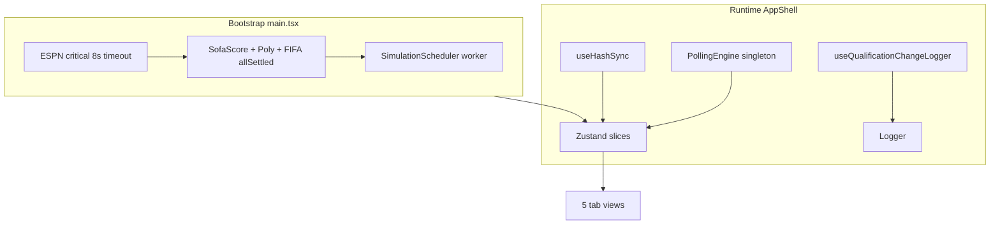

# Road to the World Cup Final 2026 — Final Architecture

All critical, high, medium, and micro gaps are resolved. The canonical plan lives at [`road_to_wc_final_5d0b0d99.plan.md`](/Users/RonalSorto/.cursor/plans/road_to_wc_final_5d0b0d99.plan.md).

## What changed (Micro-gaps 1–6)

| Gap | Locked decision |
|-----|-----------------|
| **1** Qualification logging | [`useQualificationChangeLogger.ts`](src/hooks/useQualificationChangeLogger.ts) — `useRef` differ; logs only on status **tier** change; sets `window.__lastQualificationChange` |
| **2** Deep links | [`useHashSync.ts`](src/hooks/useHashSync.ts) — `#live` / `#bracket` / `#groups` / `#simulator` / `#teams` via `history.replaceState`; no react-router |
| **3** Window typing | [`src/types/window.d.ts`](src/types/window.d.ts) — `__appLogs`, `__lastError`, `__lastBentoCrash`, `__lastQualificationChange`, `__pollingStatus`; delete all `(window as any)` |
| **4** Splash failure | `SplashPhase`: `loading` → `slow` (>2s) → `error` (ESPN fail / 8s timeout) → `done`; `SplashErrorCard` retries full `bootstrap()` |
| **5** Teams tab | [`TeamsView.tsx`](src/components/views/TeamsView.tsx) — search + filter pills + grouped A–L with stats; Live bentos stay crest-only (no duplication) |
| **6** Match schedule | `matchSchedule.json` static base; v1 free stack (SofaScore/ESPN + Polymarket + ClubElo) |

## Master API stack (locked)

**v1 ($0):** Static JSON + SofaScore/ESPN live + Polymarket + ClubElo + Monte Carlo  
**v2 (paid stubs):** TheStatsAPI centre, The Odds API, Betfair, Schedules Direct zip lookup

See full merge contract in [`road_to_wc_final_5d0b0d99.plan.md`](/Users/RonalSorto/.cursor/plans/road_to_wc_final_5d0b0d99.plan.md#master-api-stack-architect-discovery--locked-2026-06-25).

## Architecture snapshot

**Source precedence:** `manual > sofascore > espn > model`

**Navigation:** Zustand `activeTab` + hash sync (not react-router). Simulator tab holds extracted [`App.tsx`](src/App.tsx) editor verbatim.

## Execution order — Cursor Prompts 1–15

| # | Deliverable |
|---|-------------|
| 1 | Store + slices + [`window.d.ts`](src/types/window.d.ts) |
| 2 | Extended types + `matchSchedule.json` copy + `BroadcastLookup.ts` |
| 3 | `PollingEngine` + `DataMerger` (`pairKey`, `sofaEventId`) |
| 4 | Qualification selectors + `useQualificationChangeLogger` |
| 5 | `LiveMatchBento` (primary + secondary) |
| 6 | `BracketBento` + toggle |
| 7 | Qualified / Eliminated / BestThirds bentos |
| 8 | `TeamDetailSheet` (Now / Path / Odds) |
| 9 | CSS design system + WCAG |
| 10 | Vercel Edge proxies + `/espn-web/` |
| 11 | App shell + tab bar + `useHashSync` |
| 12 | `SplashScreen` (loading / slow / error) |
| 13 | Unit tests (6 vitest suites) |
| 14 | `GroupsView` |
| 15 | `TeamsView` |

**Phase 0 (before Prompt 1):** [`Logger.ts`](src/services/Logger.ts) + `window.d.ts` stubs so all prompts can log from day one.

## Manual pre-launch (cannot automate)

- Copy [`fifa_wc2026_complete_v2.json`](/Users/RonalSorto/Downloads/fifa_wc2026_complete_v2.json) → [`src/data/matchSchedule.json`](src/data/matchSchedule.json) at Prompt 2
- Create [`public/og-image.png`](public/og-image.png) (1200×630)
- Safari + 3G QA on splash, `100dvh`, safe areas, tab bar

## Key preserved files

- [`src/lib/ratings.ts`](src/lib/ratings.ts), [`predictions.ts`](src/lib/predictions.ts), [`tournament.ts`](src/lib/tournament.ts) — extend, don't replace
- [`src/data/knockoutSchedule.ts`](src/data/knockoutSchedule.ts), [`thirdPlaceMap.ts`](src/data/thirdPlaceMap.ts)
- `STORAGE_KEY` / `PICKS_KEY` localStorage overrides
- `@vercel/analytics` in [`main.tsx`](src/main.tsx)

## Ready to build

Say **execute the plan** to start **Prompt 1** (store + slices + `window.d.ts`).
