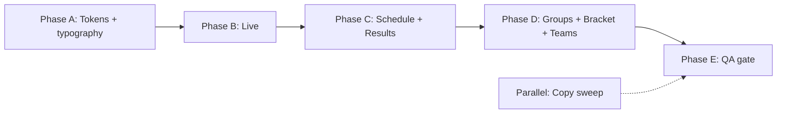

# Theme Redesign — PHASE 2 Architecture

**Status:** Locked · Discovery complete · 2026-06-27

---

## Discovery decisions (locked)

| # | Question | Decision |
|---|----------|----------|
| 1 | Scope | **Chrome + main tabs** — Live, Schedule, Groups, Bracket, Results, Teams |
| 2 | FIFA fidelity | **Inspired** — FIFA cues, our hierarchy/spacing (not pixel-perfect replica) |
| 3 | Themes | **Both** light and dark fully designed |
| 4 | Priority | **Live-first** rollout, then expand |
| 5 | Success | **Zero `?uidebug=1` issues** on main tabs (mobile 390 + desktop 1280) |
| 6 | Typography | **FWC display/scores only** — system stack for body copy |
| 7 | Cards | **Keep fixture glows** — polish edges/containment, don't remove drama |
| 8 | Team identity | **Mute washes** — keep flags/crests; slightly soften team background washes on cards |
| 9 | Motion | **Rich** — FIFA broadcast energy; goal celebration + scorer photo when roster has image |
| 10 | Live card names | **Short** — ESPN-style via `teamLiveCardNames.ts` |
| 11 | Copy sweep | **Full app** — parallel track via `appCopy.ts` |
| 12 | Goal overlay | **Scorer photo** — show when roster `image` available |

### Explicit non-goals

- Match detail, Team sheets, Tournament, Simulator visual rebrand (this phase)
- Removing team flags/crests from cards (washes may be muted, not removed)
- Removing fixture glow effects
- Single-theme-only simplification
- New API or data work

### Related locked product decisions (other tracks)

- Live card names: ESPN-style short labels (`teamLiveCardNames.ts`)
- Odds: embedded on cards, no dedicated nav tab
- Copy: full-app `appCopy.ts` sweep (parallel, not blocking theme)

---

## Design principles

1. **Chrome is FIFA-inspired; content stays team-authentic.** Nav, tabs, section kickers, and tables get the rebrand. Live hero cards keep flags/crests; **mute** `--match-home/away` wash intensity (~10–20% softer), don't remove.

2. **Display type earns FWC; everything else reads fast.** Scores, kickers, LIVE pill, group letters use FWC/WorldCup26. Body, tables, meta use system UI stack.

3. **Glow is a feature, not a bug — but it must fit.** Continue `--surface-shadow-bleed` / `--fixture-glow-bleed` pattern. Every glow wrapper gets padding or `overflow: visible` on parents intentionally.

4. **Live-first proves the system.** Ship token + layout fixes on Live before touching Groups/Bracket.

5. **Done means measurable.** `npm run ui:debug-sweep` returns 0 issues for all 6 in-scope tabs at both viewports.

---

## Token architecture

### Layers (no rewrite — extend existing)

```
styles.css          → @font-face, FWC root, keyframes
tokens.css          → semantic bridge (--text, --surface, --line)
themes.css          → light/dark FIFA-inspired palettes
layout.css          → chrome (nav, main, stripe)
app-views.css       → tab views + live hero + schedule
modules.css         → bento modules, cards, badges
team-identity.css   → team flags, labels (unchanged behavior)
edges.css           → glow wrappers, shadow bleed
```

### New / updated token groups

| Token group | Purpose |
|-------------|---------|
| `--font-display` | FWC / WorldCup26 — scores, H1 kickers, LIVE pill |
| `--font-body` | system-ui stack — tables, meta, body |
| `--heading-weight` | Already 700 — keep for section titles |
| `--section-kicker-*` | Inspired stripe-adjacent kicker styling |
| `--glow-*` | Existing bleed tokens — document per-component usage |
| `--motion-*` | Duration/easing for goal, standings flash, tab transitions |

### Light/dark parity checklist

- Contrast ≥ 4.5:1 body text on `--surface`
- Accent stripe visible in both themes
- LIVE pill + final pill readable on team washes
- Table row hover/selected states in both themes

---

## Typography spec

| Element | Font | Weight | Notes |
|---------|------|--------|-------|
| Live score | `--font-display` | 400 | Tabular nums |
| Section kicker | `--font-display` | 400 | Uppercase, letter-spacing |
| LIVE / FINAL pill | `--font-display` | 700 | Small caps feel |
| Team name (live card) | `--font-brand` → migrate display contexts to `--font-display` | 400 | Short names via `teamLiveCardName()` |
| Body, tables, meta | `--font-body` | 400–600 | 6th-grade copy track |
| Group table headers | `--font-body` | 600 | Not FWC |

**Implementation:** Add `--font-body` to `tokens.css`; scope FWC via `.type-display` utility or existing `.section-kicker`, `.live-hero-score` selectors. Remove FWC from `.team-name-text` body contexts outside display.

---

## Component scope map

### In scope — Phase B (Live)

| Component / area | Work |
|------------------|------|
| `LiveView` | Section layout, aside stacking |
| `LiveMatchBento` | Glow containment, flag badge sizing |
| `LiveGroupStandingsPanel` | Table tokens, flash animation |
| `MatchGoalScorers` | Photo row alignment (layout QA) |
| `FixtureBettingSection` | Token alignment |
| `BestThirdLiveGraph` | Panel overflow (already partially fixed) |
| `app-views.css` `.live-*` | Mobile overflow fixes from sweep |

### In scope — Phase C (Schedule, Results)

| Component | Work |
|-----------|------|
| `ScheduleView` | Day groups, card grid |
| `MatchScheduleCard` | Live card glow + short names |
| `ResultMatchCard` | Flag clip (`team-flag-inner.sm`) |
| `RecentResultsBento` | Row tokens |

### In scope — Phase D (Groups, Bracket, Teams)

| Component | Work |
|-----------|------|
| `GroupsView` | Table + toggle tokens |
| `BracketView` | Embed panel, slot tokens |
| `TeamsView` | `teams-row--accent` overflow (desktop) |
| Shared bentos | `GroupTableBento`, `BracketBento` token pass |

### Out of scope (this phase)

- `MatchDetailView`, `TeamDetailSheet`, `TournamentView`, `SimulatorView`
- Highlightly / stream tabs
- Debug toolbar styling (functional only)

---

## Layout fix backlog (from ui-debug sweep — baseline 120)

Prioritized fixes tied to architecture:

| Priority | Screen | Issue | Fix direction |
|----------|--------|-------|---------------|
| P0 | Live mobile | `team-flag-badge` horizontal overflow | Reduce badge min-width in scorer rows OR shrink flag in compact rows |
| P0 | Live mobile | `section.dashboard-section` +16px | Audit horizontal padding vs glow bleed |
| P1 | Results | `team-flag-inner.sm` vertical clip | Match container height to flag size |
| P1 | Teams desktop | `teams-row--accent` overflow + clip | `min-width: 0`, flex shrink, row height |
| P2 | Live | `span.accent` collision in h1 | Adjust kicker/accent positioning |
| P2 | Tournament | *(out of theme scope)* | Defer unless tab added to scope |

**Gate:** Re-run `npm run ui:debug-sweep` after each phase; canvas auto-updates.

---

## Motion system (rich / broadcast)

Keep and extend:

| Motion | Location | Spec |
|--------|----------|------|
| Goal celebration | `GoalCelebrationOverlay` | Burst + banner + **scorer photo** from roster when available |
| Standings flash | `LiveGroupStandingsPanel` | Rank/points/GD change highlight |
| LIVE pill pulse | `.live-pill-dot` | Subtle, already present |
| Tab switch | Optional | Short fade on main content (≤150ms) |
| Card enter | Live hero | Stagger secondary cards on load |

Avoid: layout-thrashing animations on polling paths; prefer `transform`/`opacity`.

---

## Phased implementation sequence



### Phase A — Foundation (1–2 sessions)

- Add `--font-body`, `.type-display` utilities
- Update `themes.css` inspired palette refinements (both modes)
- Chrome: `TopNavBar`, `BottomTabBar`, unify stripe consistency
- Section heading pattern across main tabs
- **Exit:** Visual review chrome only; no new uidebug regressions

### Phase B — Live (2–3 sessions)

- Fix P0 Live mobile layout issues
- Live card glow containment audit
- Rich motion pass (goal + standings)
- LiveGroupStandingsPanel token polish
- **Exit:** Live = 0 uidebug issues both viewports

### Phase C — Schedule + Results (1–2 sessions)

- Schedule card + day group tokens
- Results flag clip fix
- **Exit:** Schedule + Results = 0 issues

### Phase D — Groups + Bracket + Teams (1–2 sessions)

- Table/card token alignment
- Teams row overflow fix
- **Exit:** All 6 tabs = 0 issues

### Phase E — QA gate

- Full `npm run ui:debug-sweep`
- Manual spot-check light + dark
- Update canvas snapshot; document residual out-of-scope items
- Optional: deploy as build 11

---

## QA tooling

| Tool | Use |
|------|-----|
| `?uidebug=1` | Manual pass, marker hover for element detail |
| `npm run ui:debug-sweep` | Automated gate |
| [ui-debug-dashboard.canvas.tsx](/Users/RonalSorto/.cursor/projects/Users-RonalSorto-Developer-world-cup/canvases/ui-debug-dashboard.canvas.tsx) | Results dashboard + readme |

---

## Risks

| Risk | Mitigation |
|------|------------|
| Glow fixes re-introduce edge clipping | Keep `--fixture-glow-bleed` documented; test sweep after each change |
| FWC + system font mix feels disjoint | Limit FWC to scores/kickers only; consistent letter-spacing |
| Rich motion hurts mobile perf | `prefers-reduced-motion` respect; GPU-friendly properties |
| Scope creep into Match detail | Explicit out-of-scope list; separate future phase |
| Copy sweep conflicts with labels | Copy changes go through `appCopy.ts`; theme doesn't rename UI strings |

---

## Next action

Say **start Phase A** (or **start Phase B** if you want layout fixes before token polish) and implementation begins against this plan.
