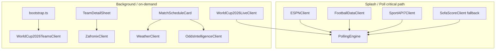

# Unified API Integration — Master Plan

## How this relates to other work

| Track | Plan file | Parallel safe? |
|---|---|---|
| **API layer** | This plan | Phases A + B scaffolding |
| **Best 3rd scenarios** | [`best_3rd_scenarios_ee6d0f88.plan.md`](/Users/RonalSorto/.cursor/plans/best_3rd_scenarios_ee6d0f88.plan.md) | Phase 1 (`bestThirdScenarios.ts`) — **no overlap** |
| **Supersedes** | [`rapidapi_football_data_e3093ed0.plan.md`](/Users/RonalSorto/.cursor/plans/rapidapi_football_data_e3093ed0.plan.md) | FotMob + SportAPI7 + WC2026 teams folded in here |

Wait for **`EXECUTE`** (or **`EXECUTE API`**) before writing code. Complete one phase at a time.

---

## API roster (your audit → our roles)

| # | API | Host | Role in app | Priority |
|---|---|---|---|---|
| 1 | **ESPN** (existing) | `site.api.espn.com` | Splash + poll baseline — WC scoreboard | Keep |
| 2 | **FotMob** (Free API Live Football Data) | `free-api-live-football-data.p.rapidapi.com` | Live poll enrichment #1 | High |
| 3 | **SportAPI7** | `sportapi7.p.rapidapi.com` | Live poll enrichment #2 + **incidents** (`category/1468`) | High |
| 4 | **WC 2026 Live** (`jxancestral17`) | `world-cup-2026-live-api.p.rapidapi.com` | Draw, standings verify, live, commentary, lineups, stats | High (paid) |
| 5 | **WC 2026 Teams** (`maayanadmin2`) | `world-cup-2026.p.rapidapi.com` | Bootstrap: 48 teams logos/colors; player photos on demand | Medium |
| 6 | **Zafronix** | `api.zafronix.com` | Historical form, rosters, trivia — **on demand** | Medium |
| 7 | **Sports Odds Intelligence** | `sports-odds-intelligence-api.p.rapidapi.com` | Bookmaker odds on cards (supplements Polymarket) | Low |
| 8 | **Open Weather 13** | `open-weather13.p.rapidapi.com` | Weather badge on fixture cards | Low |
| — | **SofaScore6** | — | **Skip** — only 2 endpoints | Out |
| — | **Direct SofaScore** (existing) | `api.sofascore.com` | Tertiary poll fallback only | Keep disabled |

**Polymarket** (existing) stays primary for prediction markets / sim — Odds API is additive for sportsbook lines.

---

## Architecture (split responsibilities)



**Do NOT stuff everything into `PollingEngine`.** Split schedulers:

| Scheduler | Interval | Source |
|---|---|---|
| `PollingEngine` | 15s live / 5m idle | ESPN + FotMob → SportAPI7 → SofaScore |
| `WCLiveScheduler` (new, small) | 60s when live matches | WC Live `/wc/live`, `/wc/standings` |
| `WeatherCache` | 30 min per city key | Open Weather |
| `OddsCache` | 5 min per event | Sports Odds Intelligence |
| On-demand | User click | Zafronix history, WC teams players, WC match detail |

---

## Client naming (avoid collisions)

| Your prompt name | Our file | Notes |
|---|---|---|
| `WC2026Client` | `WorldCup2026TeamsClient.ts` | `/world-cup-2026/teams` (maayanadmin2) |
| `WC2026LiveClient` | `WorldCup2026LiveClient.ts` | `/wc/draw`, `/wc/live`, etc. |
| `FootballDataClient` | `FootballDataClient.ts` | FotMob — from prior plan |
| `ZafronixClient` | `ZafronixClient.ts` | Separate auth: `X-API-Key` |
| `OddsClient` | `OddsIntelligenceClient.ts` | Disambiguate from Polymarket |
| `WeatherClient` | `WeatherClient.ts` | |

Shared patterns (mirror [`SofaScoreClient.ts`](src/services/SofaScoreClient.ts)):
- `is*Disabled()` session flags on 401/403/429
- `logger.warn` + `bodySnippet`
- `reset*SessionForTests()` for Vitest

---

## Environment variables

```bash
# .env.local (gitignored) — .env.example has empty placeholders
VITE_RAPIDAPI_KEY=          # All RapidAPI hosts
RAPIDAPI_KEY=               # Vercel Edge proxies (server-only)

ZAFRONIX_API_KEY=           # Direct Zafronix (not RapidAPI)
VITE_ZAFRONIX_API_KEY=      # Dev-only if browser calls Zafronix via proxy
```

Single `RAPIDAPI_KEY` covers: FotMob, SportAPI7, WC Teams, WC Live, Open Weather, Odds Intelligence.

Add types to [`src/vite-env.d.ts`](src/vite-env.d.ts).

---

## Phase A — Foundation (parallel with Best 3rd Phase 1)

**Goal:** Flags, proxies, audit script — no UI yet.

1. Extend [`src/config/apiFlags.ts`](src/config/apiFlags.ts):

```ts
| "footballDataApi" | "sportApi7" | "wc2026Teams" | "wc2026Live"
| "zafronix" | "oddsIntelligence" | "openWeather"
```

2. **Vite proxies** in [`vite.config.ts`](vite.config.ts):

| Path | Target |
|---|---|
| `/rapidapi` | `free-api-live-football-data.p.rapidapi.com` |
| `/rapidapi-sportapi` | `sportapi7.p.rapidapi.com` |
| `/rapidapi-wc2026` | `world-cup-2026.p.rapidapi.com` |
| `/rapidapi-wc-live` | `world-cup-2026-live-api.p.rapidapi.com` |
| `/rapidapi-weather` | `open-weather13.p.rapidapi.com` |
| `/rapidapi-odds` | `sports-odds-intelligence-api.p.rapidapi.com` |
| `/api/zafronix` | `api.zafronix.com` |

3. **Edge proxies** (allowlist + inject keys):

- [`api/footballdata/[...path].ts`](api/footballdata/[...path].ts)
- [`api/sportapi/[...path].ts`](api/sportapi/[...path].ts)
- [`api/wc2026/[...path].ts`](api/wc2026/[...path].ts) — teams API paths
- [`api/wc-live/[...path].ts`](api/wc-live/[...path].ts) — live API `/wc/*`
- [`api/weather/[...path].ts`](api/weather/[...path].ts)
- [`api/odds/[...path].ts`](api/odds/[...path].ts)
- [`api/zafronix/[...path].ts`](api/zafronix/[...path].ts) — `X-API-Key: process.env.ZAFRONIX_API_KEY`

4. Extend [`scripts/test-all-apis.mjs`](scripts/test-all-apis.mjs) — one probe per new host.

5. Create [`.env.example`](.env.example).

---

## Phase B — Live data clients + PollingEngine

(Replaces prior RapidAPI plan Phases 1–2)

1. **`FootballDataClient.ts`** — `fetchScheduledToday()` → `SofaEvent[]`; `fetchIncidents` → `[]`
   - Endpoints: `/football-get-matches-by-date`, `/football-current-live`

2. **`SportAPI7Client.ts`** — `SPORTAPI_WC_CATEGORY_ID = 1468`
   - `fetchScheduledToday()`, `fetchIncidents(eventId)`

3. **`WorldCup2026LiveClient.ts`**
   - `fetchDraw()`, `fetchStandings()`, `fetchLive()`, `fetchMatchDetail(id)`, `fetchCommentary(id)`, `fetchLineups(id)`, `fetchStats(id)`
   - Map commentary cards → conduct enrichment where possible

4. **Update [`PollingEngine.ts`](src/services/PollingEngine.ts):**
   - ESPN always
   - Enrichment cascade: FotMob → SportAPI7 → SofaScore
   - Optional: merge WC Live `/wc/live` scores when ESPN match IDs link via `matchId` / kickoff+teams

5. **`WCLiveScheduler.ts`** — 60s poll during live window; writes to store slice `wcLiveEnrichment` (new optional slice or extend `matchSlice`)

6. Vitest: client mapper tests + existing `DataMerger` tests unchanged

**Constraints preserved:** `SofaEvent` shape unchanged; `SofaScoreClient` kept; ESPN fallback intact.

---

## Phase C — Bootstrap team metadata

1. **`WorldCup2026TeamsClient.ts`** — `GET /world-cup-2026/teams`
2. `mergeTeamMetadata(espnTeams, wcTeams)` by abbreviation
3. Hook in [`bootstrap.ts`](src/lib/bootstrap.ts) `startBackgroundEnrichment()`

Also probe: `/players`, `/team`, `/tournament-information` for future TeamDetailSheet use.

---

## Phase D — Weather on fixture cards

**Blocker:** [`matchSchedule.json`](src/data/matchSchedule.json) venues have city/tz but **no lat/lon**.

1. Add [`src/data/venueCoordinates.ts`](src/data/venueCoordinates.ts) — static map: venue name → `{ lat, lon }` for 16 WC stadiums
2. **`WeatherClient.ts`** — `getWeather(lat, lon)`, `getIcon`, `getConditionLabel`, `getRainChance`
3. **`WeatherCache.ts`** — in-memory Map, 30 min TTL per `city` or `venueId`
4. **`WeatherBadge.tsx`** — small component
5. Wire into [`MatchScheduleCard.tsx`](src/components/match/MatchScheduleCard.tsx) (not `FixtureCard` — **does not exist**)
   - Also [`ResultMatchCard.tsx`](src/components/match/ResultMatchCard.tsx) if applicable

---

## Phase E — Zafronix historical form

1. **`ZafronixClient.ts`** — `getTournament(2026)`, `getHistoricalMatchesForTeam(name, 7)`, `getTrivia()`
2. **UI target:** extend [`TeamDetailSheet.tsx`](src/components/team-detail/TeamDetailSheet.tsx) "Now" tab OR new match-detail drawer (no `FixtureCardDetail.tsx` yet)
   - "Recent form" pills: W/L/D, opponent, score, WC gold border when `isWorldCup`
   - Collapsible section below existing match history
3. On fixture card click: if match detail panel is added later, same component reused

---

## Phase F — Odds on cards

1. **`OddsIntelligenceClient.ts`** — `getLiveOdds()`, `getBestLines(eventId)` (exact paths from RapidAPI playground)
2. **`OddsCache.ts`** — 5 min TTL
3. Small odds row on `MatchScheduleCard` — Home | Draw | Away
4. Keep Polymarket data in sim/bracket; label sportsbook odds distinctly

TeamDetailSheet odds tab stub (`Sportsbook consensus: —`) gets real data here.

---

## Phase G — WC Live detail enrichment

When user opens match detail (future `MatchDetailSheet` or extend live hero):
- Lineups, stats, commentary from `WorldCup2026LiveClient`
- Goal scorer / MOTM photos from `WorldCup2026TeamsClient` `/player-photo` if IDs link

Defer until Phase B live client is stable.

---

## Codebase mapping (prompt corrections)

| Master prompt says | Actual codebase |
|---|---|
| `FixtureCard.tsx` | [`MatchScheduleCard.tsx`](src/components/match/MatchScheduleCard.tsx), [`ResultMatchCard.tsx`](src/components/match/ResultMatchCard.tsx) |
| `FixtureCardDetail.tsx` | Does not exist — build `MatchDetailPanel.tsx` or extend `TeamDetailSheet` |
| `OPENWEATHER_API_KEY` | Use shared `RAPIDAPI_KEY` via open-weather13 RapidAPI host |
| `RAPIDAPI_HOST=free-api...` | **Wrong** — one key, many hosts via `x-rapidapi-host` per client |
| PollingEngine owns weather/odds/history | Split into dedicated caches/schedulers |
| SofaScore6 | Excluded |
| 12 third-place teams | [`BestThirdTableBento`](src/components/bentos/BestThirdTableBento.tsx) — separate feature track |

---

## Execution protocol

```
EXECUTE API A     → Phase A only
EXECUTE API B     → Phase B only
…
EXECUTE           → Best 3rd scenarios Phase 1 (separate plan)
EXECUTE ALL       → explicit only — do not assume
```

After each API phase: list files + deviations + `npm test` / `npm run build`.

---

## Recommended parallel timeline

| Week / sprint | API track | Best 3rd track |
|---|---|---|
| Now | Phase A scaffolding | Phase 1 `bestThirdScenarios.ts` + tests |
| Next | Phase B live clients | Phase 2–3 hook + popover |
| Then | Phase C–D bootstrap + weather | Phase 4–5 wire bento |

No file conflicts between **API Phase A** and **Best 3rd Phase 1**.
