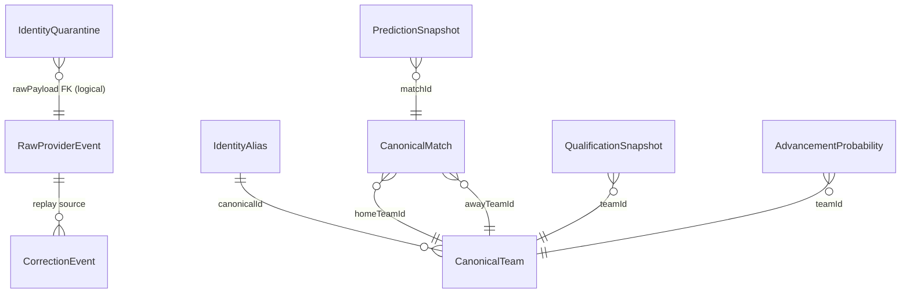

# World Cup 2026 Engine — Entity Relationship Diagram

Source of truth: [`prisma/schema.prisma`](../../prisma/schema.prisma). Bounded contexts map to table groups below.

## Overview

## BC1 — Identity & intake

| Model | Purpose |
|-------|---------|
| `IdentityAlias` | Provider external id → canonical id (exact/fuzzy/manual) |
| `IdentityQuarantine` | Unresolved fuzzy matches awaiting analyst action |
| `IdentityAuditLog` | Append-only identity override audit |
| `RawProviderEvent` | Append-only provider payloads |
| `CorrectionEvent` | Analyst field corrections (replay on top of raw log) |
| `ProviderHealth` | Circuit breaker + poll health per provider |

**Rules:** Never delete raw events. Fuzzy below threshold → quarantine only. Corrections append-only.

## BC1 — Canonical store

| Model | Purpose |
|-------|---------|
| `CanonicalTeam` | 48 nations + metadata (`shortCode`, group, Elo) |
| `CanonicalPlayer` | Squad members linked to `teamId` |
| `CanonicalMatch` | Schedule, scores, `resultLocked` flag |
| `CanonicalVenue` | Stadium / host city metadata |

All canonical rows carry optional `sourceTrace` JSON for field-level provenance.

## BC2 — Official qualification

| Model | Purpose |
|-------|---------|
| `QualificationSnapshot` | Immutable engine output per team/group recompute |

Key fields: `tier`, `certainty`, `lifeState`, `engineVersion`, `inputHash`.

Triggered only by locked match results — never live scores alone.

## BC3 — Prediction & scenarios

| Model | Purpose |
|-------|---------|
| `PredictionSnapshot` | Match outcome probabilities + factor attribution |
| `AdvancementProbability` | Per-team stage advancement (R32, R16, …) |

Scenario rows use `isScenario` + `scenarioId` (Redis TTL for workspace state).

## Status contracts

| Layer | Type location | Values |
|-------|---------------|--------|
| Engine (BC2) | `@wc2026/canonical` `QualificationEngineStatus` | `qualified`, `at_risk`, `projected_out`, `eliminated`, `pending` |
| Display (UI) | `@wc2026/canonical` `QualificationDisplayTier` | `qualified`, `alive`, `projected_out`, `eliminated` |
| Worker snapshot | `QualificationSnapshot.tier` | `CHAMPION`, `RUNNER_UP`, `THIRD`, … |

Map engine → display only in `src/lib/qualificationView.ts` / `qualificationDisplay.ts`.

## Indexes (high traffic)

- `IdentityAlias (providerId, externalId, entityType)` — unique resolve path
- `QualificationSnapshot (groupId, createdAt)` — latest snapshot per group
- `RawProviderEvent (providerId, ingestedAt)` — replay windows
